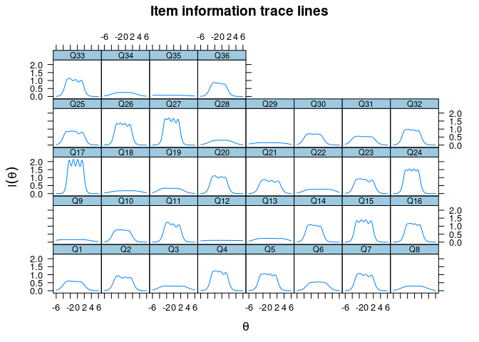
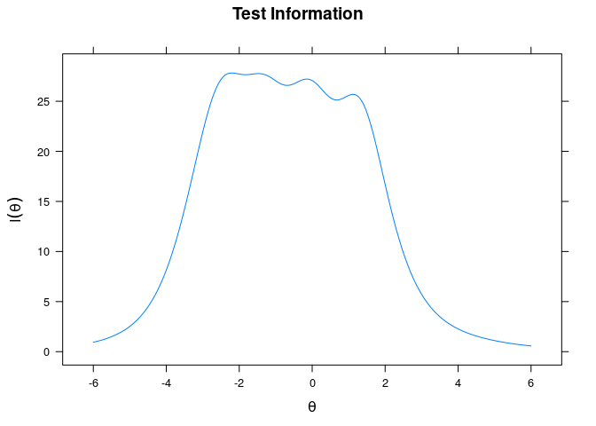
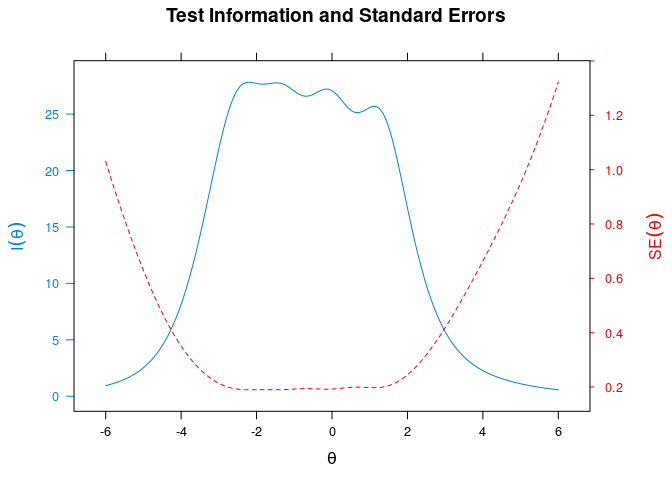
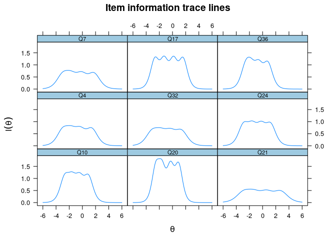
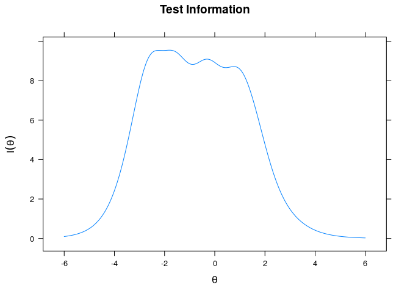
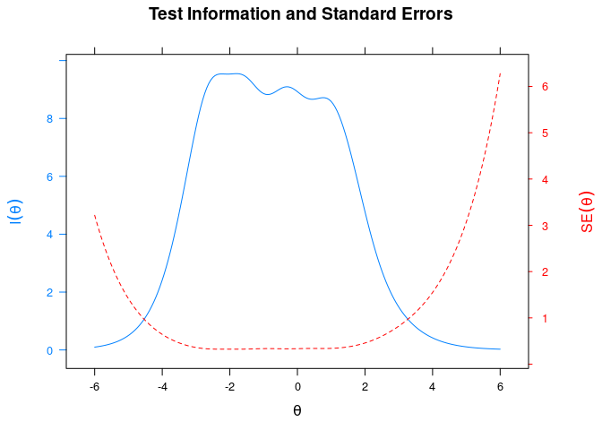

Factor Analysis of DFS-BR
================
Geiser Chalco Challco <geiser@alumni.usp.br>

-   [Prerequisites](#prerequisites)
    -   [Loading libs](#loading-libs)
    -   [Loading data](#loading-data)
    -   [Checking assumptions](#checking-assumptions)
        -   [Evaluating normality](#evaluating-normality)
        -   [Performing Kaiser, Meyer, Olkin (KMO) Measure of Sampling
            Adequacy](#performing-kaiser-meyer-olkin-kmo-measure-of-sampling-adequacy)
        -   [Summarizing descriptives and
            KMOs](#summarizing-descriptives-and-kmos)
        -   [Performing Bartlett’s test of
            sphericity](#performing-bartletts-test-of-sphericity)
-   [Construct validity](#construct-validity)
    -   [Structural validity](#structural-validity)
        -   [CFA in the multicorrelated
            model](#cfa-in-the-multicorrelated-model)
        -   [CFA in the 2nd-order model](#cfa-in-the-2nd-order-model)
        -   [CFA in the short version of DFS-BR
            (DFS-short)](#cfa-in-the-short-version-of-dfs-br-dfs-short)
        -   [CFA in an alternative short version of DFS-BR
            (DFS-short2)](#cfa-in-an-alternative-short-version-of-dfs-br-dfs-short2)
        -   [Summarize the fit indexes and draw the diagrams of CFA
            models](#summarize-the-fit-indexes-and-draw-the-diagrams-of-cfa-models)
    -   [Internal consistency
        (reliability)](#internal-consistency-reliability)
    -   [Convergent validity and discriminant
        validity](#convergent-validity-and-discriminant-validity)
-   [Item quality analysis based on
    IRT](#item-quality-analysis-based-on-irt)
    -   [IRT analysis in the long version of the
        DFS-BR](#irt-analysis-in-the-long-version-of-the-dfs-br)
        -   [Estimate parameters](#estimate-parameters)
        -   [Graphs of test information
            curve](#graphs-of-test-information-curve)
    -   [IRT analysis in the short version of the
        DFS-BR](#irt-analysis-in-the-short-version-of-the-dfs-br)
        -   [Estimate parameters](#estimate-parameters-1)
        -   [Graphs of test information
            curve](#graphs-of-test-information-curve-1)


# Prerequisites

- script: [script.R](script.R)
- DataSet: [data-dfs.csv](data-dfs.csv) OR [dfs2-data.xlsx](dfs2-data.xlsx)

## Loading libs

``` r
library(readr)
library(dplyr)
library(psych)
library(lavaan)
library(olsrr)
library(semTools)
library(mirt)
```

## Loading data

``` r
raw_data <- read.csv("data-dfs.csv")
dfs <- as.data.frame(sapply(select(raw_data, starts_with("Q")), as.integer))
```

## Checking assumptions

### Evaluating normality

``` r
(mvn_mod <- MVN::mvn(dfs))
```

    ## Registered S3 method overwritten by 'GGally':
    ##   method from   
    ##   +.gg   ggplot2

    ## sROC 0.1-2 loaded

    ## $multivariateNormality
    ##              Test        Statistic p value Result
    ## 1 Mardia Skewness 20417.4691491628       0     NO
    ## 2 Mardia Kurtosis 103.630442370659       0     NO
    ## 3             MVN             <NA>    <NA>     NO
    ## 
    ## $univariateNormality
    ##            Test  Variable Statistic   p value Normality
    ## 1  Shapiro-Wilk    Q1        0.8714  <0.001      NO    
    ## 2  Shapiro-Wilk    Q2        0.8707  <0.001      NO    
    ## 3  Shapiro-Wilk    Q3        0.9017  <0.001      NO    
    ## 4  Shapiro-Wilk    Q4        0.8711  <0.001      NO    
    ## 5  Shapiro-Wilk    Q5        0.8872  <0.001      NO    
    ## 6  Shapiro-Wilk    Q6        0.9159  <0.001      NO    
    ## 7  Shapiro-Wilk    Q7        0.8701  <0.001      NO    
    ## 8  Shapiro-Wilk    Q8        0.9156  <0.001      NO    
    ## 9  Shapiro-Wilk    Q9        0.8914  <0.001      NO    
    ## 10 Shapiro-Wilk    Q10       0.8723  <0.001      NO    
    ## 11 Shapiro-Wilk    Q11       0.8674  <0.001      NO    
    ## 12 Shapiro-Wilk    Q12       0.8994  <0.001      NO    
    ## 13 Shapiro-Wilk    Q13       0.9030  <0.001      NO    
    ## 14 Shapiro-Wilk    Q14       0.8450  <0.001      NO    
    ## 15 Shapiro-Wilk    Q15       0.8798  <0.001      NO    
    ## 16 Shapiro-Wilk    Q16       0.8994  <0.001      NO    
    ## 17 Shapiro-Wilk    Q17       0.8888  <0.001      NO    
    ## 18 Shapiro-Wilk    Q18       0.9102  <0.001      NO    
    ## 19 Shapiro-Wilk    Q19       0.8926  <0.001      NO    
    ## 20 Shapiro-Wilk    Q20       0.8732  <0.001      NO    
    ## 21 Shapiro-Wilk    Q21       0.8772  <0.001      NO    
    ## 22 Shapiro-Wilk    Q22       0.9011  <0.001      NO    
    ## 23 Shapiro-Wilk    Q23       0.8620  <0.001      NO    
    ## 24 Shapiro-Wilk    Q24       0.8859  <0.001      NO    
    ## 25 Shapiro-Wilk    Q25       0.8522  <0.001      NO    
    ## 26 Shapiro-Wilk    Q26       0.8815  <0.001      NO    
    ## 27 Shapiro-Wilk    Q27       0.8841  <0.001      NO    
    ## 28 Shapiro-Wilk    Q28       0.9154  <0.001      NO    
    ## 29 Shapiro-Wilk    Q29       0.9139  <0.001      NO    
    ## 30 Shapiro-Wilk    Q30       0.8525  <0.001      NO    
    ## 31 Shapiro-Wilk    Q31       0.8817  <0.001      NO    
    ## 32 Shapiro-Wilk    Q32       0.8761  <0.001      NO    
    ## 33 Shapiro-Wilk    Q33       0.8527  <0.001      NO    
    ## 34 Shapiro-Wilk    Q34       0.9098  <0.001      NO    
    ## 35 Shapiro-Wilk    Q35       0.8846  <0.001      NO    
    ## 36 Shapiro-Wilk    Q36       0.8463  <0.001      NO    
    ## 
    ## $Descriptives
    ##       n     Mean   Std.Dev Median Min Max 25th 75th        Skew    Kurtosis
    ## Q1  681 3.737151 0.9670681      4   1   5    3    4 -0.63508632  0.25180009
    ## Q2  681 3.562408 0.9039112      4   1   5    3    4 -0.50812683  0.44762589
    ## Q3  681 3.105727 0.9779839      3   1   5    3    4 -0.16498355 -0.18973243
    ## Q4  681 3.637298 0.9310120      4   1   5    3    4 -0.62079659  0.32070424
    ## Q5  681 3.469897 0.9311859      4   1   5    3    4 -0.40347635  0.01281483
    ## Q6  681 3.079295 1.0831042      3   1   5    2    4 -0.05328326 -0.66269459
    ## Q7  681 3.522761 0.8976253      4   1   5    3    4 -0.54929590  0.42561895
    ## Q8  681 3.002937 1.1832123      3   1   5    2    4  0.06348234 -0.82197148
    ## Q9  681 3.555066 1.0118308      4   1   5    3    4 -0.42206273 -0.14280840
    ## Q10 681 3.751836 0.9874657      4   1   5    3    4 -0.65112128  0.10983027
    ## Q11 681 3.484581 0.9362693      4   1   5    3    4 -0.64776772  0.44808973
    ## Q12 681 2.882526 0.9335275      3   1   5    2    4 -0.05784849 -0.35933614
    ## Q13 681 2.925110 0.9511453      3   1   5    2    4 -0.02474729 -0.31961875
    ## Q14 681 3.941263 0.9311998      4   1   5    3    5 -0.83281908  0.61715140
    ## Q15 681 3.537445 0.8938476      4   1   5    3    4 -0.41471577  0.08066487
    ## Q16 681 3.339207 0.9930961      3   1   5    3    4 -0.33889412 -0.19848317
    ## Q17 681 3.380323 0.9013848      3   1   5    3    4 -0.24229755 -0.05246614
    ## Q18 681 2.785609 1.1598041      3   1   5    2    4  0.27015311 -0.68997461
    ## Q19 681 3.500734 1.0348697      3   1   5    3    4 -0.35571836 -0.20594922
    ## Q20 681 3.718062 0.9454752      4   1   5    3    4 -0.55005442  0.21717588
    ## Q21 681 3.167401 0.8802709      3   1   5    3    4 -0.33112955  0.18874556
    ## Q22 681 2.813510 0.9481528      3   1   5    2    3  0.09893746 -0.23561800
    ## Q23 681 3.538913 0.8704451      4   1   5    3    4 -0.59350810  0.45926016
    ## Q24 681 3.627019 0.9542959      4   1   5    3    4 -0.43550614 -0.08312476
    ## Q25 681 3.698972 0.8688137      4   1   5    3    4 -0.69609095  0.61835998
    ## Q26 681 3.566814 0.9213242      4   1   5    3    4 -0.46100978  0.10938102
    ## Q27 681 3.513950 0.9140388      4   1   5    3    4 -0.39304805  0.06370338
    ## Q28 681 3.071953 1.2038384      3   1   5    2    4 -0.03196476 -0.90439080
    ## Q29 681 3.123348 1.1164800      3   1   5    2    4 -0.07907218 -0.59446496
    ## Q30 681 3.920705 0.9699288      4   1   5    3    5 -0.74909197  0.25232014
    ## Q31 681 3.566814 0.9229190      4   1   5    3    4 -0.40893859  0.13214316
    ## Q32 681 3.663730 0.9408961      4   1   5    3    4 -0.56731414  0.20955183
    ## Q33 681 3.745962 0.8686123      4   1   5    3    4 -0.68302204  0.80165213
    ## Q34 681 3.229075 1.2261035      3   1   5    2    4 -0.15989817 -0.89860453
    ## Q35 681 3.627019 1.0649930      4   1   5    3    4 -0.55150413 -0.15062892
    ## Q36 681 3.861968 0.9709190      4   1   5    3    5 -0.88683427  0.76632467

### Performing Kaiser, Meyer, Olkin (KMO) Measure of Sampling Adequacy

``` r
(kmo_mod <- KMO(dfs)) 
```

    ## Kaiser-Meyer-Olkin factor adequacy
    ## Call: KMO(r = dfs)
    ## Overall MSA =  0.94
    ## MSA for each item = 
    ##   Q1   Q2   Q3   Q4   Q5   Q6   Q7   Q8   Q9  Q10  Q11  Q12  Q13  Q14  Q15  Q16 
    ## 0.97 0.96 0.96 0.96 0.96 0.97 0.96 0.89 0.83 0.95 0.96 0.89 0.88 0.93 0.95 0.93 
    ##  Q17  Q18  Q19  Q20  Q21  Q22  Q23  Q24  Q25  Q26  Q27  Q28  Q29  Q30  Q31  Q32 
    ## 0.96 0.91 0.94 0.95 0.95 0.87 0.97 0.94 0.96 0.96 0.98 0.90 0.91 0.96 0.94 0.94 
    ##  Q33  Q34  Q35  Q36 
    ## 0.97 0.88 0.79 0.95

### Summarizing descriptives and KMOs

``` r
t(round(cbind(mvn_mod$Descriptives[,c("Mean","Std.Dev","Median","Skew","Kurtosis")],"MSA"=kmo_mod$MSAi),2))
```

<table>
<thead>
<tr>
<th style="text-align:left;">
</th>
<th style="text-align:right;">
Q1
</th>
<th style="text-align:right;">
Q2
</th>
<th style="text-align:right;">
Q3
</th>
<th style="text-align:right;">
Q4
</th>
<th style="text-align:right;">
Q5
</th>
<th style="text-align:right;">
Q6
</th>
<th style="text-align:right;">
Q7
</th>
<th style="text-align:right;">
Q8
</th>
<th style="text-align:right;">
Q9
</th>
<th style="text-align:right;">
Q10
</th>
<th style="text-align:right;">
Q11
</th>
<th style="text-align:right;">
Q12
</th>
<th style="text-align:right;">
Q13
</th>
<th style="text-align:right;">
Q14
</th>
<th style="text-align:right;">
Q15
</th>
<th style="text-align:right;">
Q16
</th>
<th style="text-align:right;">
Q17
</th>
<th style="text-align:right;">
Q18
</th>
<th style="text-align:right;">
Q19
</th>
<th style="text-align:right;">
Q20
</th>
<th style="text-align:right;">
Q21
</th>
<th style="text-align:right;">
Q22
</th>
<th style="text-align:right;">
Q23
</th>
<th style="text-align:right;">
Q24
</th>
<th style="text-align:right;">
Q25
</th>
<th style="text-align:right;">
Q26
</th>
<th style="text-align:right;">
Q27
</th>
<th style="text-align:right;">
Q28
</th>
<th style="text-align:right;">
Q29
</th>
<th style="text-align:right;">
Q30
</th>
<th style="text-align:right;">
Q31
</th>
<th style="text-align:right;">
Q32
</th>
<th style="text-align:right;">
Q33
</th>
<th style="text-align:right;">
Q34
</th>
<th style="text-align:right;">
Q35
</th>
<th style="text-align:right;">
Q36
</th>
</tr>
</thead>
<tbody>
<tr>
<td style="text-align:left;">
Mean
</td>
<td style="text-align:right;">
3.74
</td>
<td style="text-align:right;">
3.56
</td>
<td style="text-align:right;">
3.11
</td>
<td style="text-align:right;">
3.64
</td>
<td style="text-align:right;">
3.47
</td>
<td style="text-align:right;">
3.08
</td>
<td style="text-align:right;">
3.52
</td>
<td style="text-align:right;">
3.00
</td>
<td style="text-align:right;">
3.56
</td>
<td style="text-align:right;">
3.75
</td>
<td style="text-align:right;">
3.48
</td>
<td style="text-align:right;">
2.88
</td>
<td style="text-align:right;">
2.93
</td>
<td style="text-align:right;">
3.94
</td>
<td style="text-align:right;">
3.54
</td>
<td style="text-align:right;">
3.34
</td>
<td style="text-align:right;">
3.38
</td>
<td style="text-align:right;">
2.79
</td>
<td style="text-align:right;">
3.50
</td>
<td style="text-align:right;">
3.72
</td>
<td style="text-align:right;">
3.17
</td>
<td style="text-align:right;">
2.81
</td>
<td style="text-align:right;">
3.54
</td>
<td style="text-align:right;">
3.63
</td>
<td style="text-align:right;">
3.70
</td>
<td style="text-align:right;">
3.57
</td>
<td style="text-align:right;">
3.51
</td>
<td style="text-align:right;">
3.07
</td>
<td style="text-align:right;">
3.12
</td>
<td style="text-align:right;">
3.92
</td>
<td style="text-align:right;">
3.57
</td>
<td style="text-align:right;">
3.66
</td>
<td style="text-align:right;">
3.75
</td>
<td style="text-align:right;">
3.23
</td>
<td style="text-align:right;">
3.63
</td>
<td style="text-align:right;">
3.86
</td>
</tr>
<tr>
<td style="text-align:left;">
Std.Dev
</td>
<td style="text-align:right;">
0.97
</td>
<td style="text-align:right;">
0.90
</td>
<td style="text-align:right;">
0.98
</td>
<td style="text-align:right;">
0.93
</td>
<td style="text-align:right;">
0.93
</td>
<td style="text-align:right;">
1.08
</td>
<td style="text-align:right;">
0.90
</td>
<td style="text-align:right;">
1.18
</td>
<td style="text-align:right;">
1.01
</td>
<td style="text-align:right;">
0.99
</td>
<td style="text-align:right;">
0.94
</td>
<td style="text-align:right;">
0.93
</td>
<td style="text-align:right;">
0.95
</td>
<td style="text-align:right;">
0.93
</td>
<td style="text-align:right;">
0.89
</td>
<td style="text-align:right;">
0.99
</td>
<td style="text-align:right;">
0.90
</td>
<td style="text-align:right;">
1.16
</td>
<td style="text-align:right;">
1.03
</td>
<td style="text-align:right;">
0.95
</td>
<td style="text-align:right;">
0.88
</td>
<td style="text-align:right;">
0.95
</td>
<td style="text-align:right;">
0.87
</td>
<td style="text-align:right;">
0.95
</td>
<td style="text-align:right;">
0.87
</td>
<td style="text-align:right;">
0.92
</td>
<td style="text-align:right;">
0.91
</td>
<td style="text-align:right;">
1.20
</td>
<td style="text-align:right;">
1.12
</td>
<td style="text-align:right;">
0.97
</td>
<td style="text-align:right;">
0.92
</td>
<td style="text-align:right;">
0.94
</td>
<td style="text-align:right;">
0.87
</td>
<td style="text-align:right;">
1.23
</td>
<td style="text-align:right;">
1.06
</td>
<td style="text-align:right;">
0.97
</td>
</tr>
<tr>
<td style="text-align:left;">
Median
</td>
<td style="text-align:right;">
4.00
</td>
<td style="text-align:right;">
4.00
</td>
<td style="text-align:right;">
3.00
</td>
<td style="text-align:right;">
4.00
</td>
<td style="text-align:right;">
4.00
</td>
<td style="text-align:right;">
3.00
</td>
<td style="text-align:right;">
4.00
</td>
<td style="text-align:right;">
3.00
</td>
<td style="text-align:right;">
4.00
</td>
<td style="text-align:right;">
4.00
</td>
<td style="text-align:right;">
4.00
</td>
<td style="text-align:right;">
3.00
</td>
<td style="text-align:right;">
3.00
</td>
<td style="text-align:right;">
4.00
</td>
<td style="text-align:right;">
4.00
</td>
<td style="text-align:right;">
3.00
</td>
<td style="text-align:right;">
3.00
</td>
<td style="text-align:right;">
3.00
</td>
<td style="text-align:right;">
3.00
</td>
<td style="text-align:right;">
4.00
</td>
<td style="text-align:right;">
3.00
</td>
<td style="text-align:right;">
3.00
</td>
<td style="text-align:right;">
4.00
</td>
<td style="text-align:right;">
4.00
</td>
<td style="text-align:right;">
4.00
</td>
<td style="text-align:right;">
4.00
</td>
<td style="text-align:right;">
4.00
</td>
<td style="text-align:right;">
3.00
</td>
<td style="text-align:right;">
3.00
</td>
<td style="text-align:right;">
4.00
</td>
<td style="text-align:right;">
4.00
</td>
<td style="text-align:right;">
4.00
</td>
<td style="text-align:right;">
4.00
</td>
<td style="text-align:right;">
3.00
</td>
<td style="text-align:right;">
4.00
</td>
<td style="text-align:right;">
4.00
</td>
</tr>
<tr>
<td style="text-align:left;">
Skew
</td>
<td style="text-align:right;">
-0.64
</td>
<td style="text-align:right;">
-0.51
</td>
<td style="text-align:right;">
-0.16
</td>
<td style="text-align:right;">
-0.62
</td>
<td style="text-align:right;">
-0.40
</td>
<td style="text-align:right;">
-0.05
</td>
<td style="text-align:right;">
-0.55
</td>
<td style="text-align:right;">
0.06
</td>
<td style="text-align:right;">
-0.42
</td>
<td style="text-align:right;">
-0.65
</td>
<td style="text-align:right;">
-0.65
</td>
<td style="text-align:right;">
-0.06
</td>
<td style="text-align:right;">
-0.02
</td>
<td style="text-align:right;">
-0.83
</td>
<td style="text-align:right;">
-0.41
</td>
<td style="text-align:right;">
-0.34
</td>
<td style="text-align:right;">
-0.24
</td>
<td style="text-align:right;">
0.27
</td>
<td style="text-align:right;">
-0.36
</td>
<td style="text-align:right;">
-0.55
</td>
<td style="text-align:right;">
-0.33
</td>
<td style="text-align:right;">
0.10
</td>
<td style="text-align:right;">
-0.59
</td>
<td style="text-align:right;">
-0.44
</td>
<td style="text-align:right;">
-0.70
</td>
<td style="text-align:right;">
-0.46
</td>
<td style="text-align:right;">
-0.39
</td>
<td style="text-align:right;">
-0.03
</td>
<td style="text-align:right;">
-0.08
</td>
<td style="text-align:right;">
-0.75
</td>
<td style="text-align:right;">
-0.41
</td>
<td style="text-align:right;">
-0.57
</td>
<td style="text-align:right;">
-0.68
</td>
<td style="text-align:right;">
-0.16
</td>
<td style="text-align:right;">
-0.55
</td>
<td style="text-align:right;">
-0.89
</td>
</tr>
<tr>
<td style="text-align:left;">
Kurtosis
</td>
<td style="text-align:right;">
0.25
</td>
<td style="text-align:right;">
0.45
</td>
<td style="text-align:right;">
-0.19
</td>
<td style="text-align:right;">
0.32
</td>
<td style="text-align:right;">
0.01
</td>
<td style="text-align:right;">
-0.66
</td>
<td style="text-align:right;">
0.43
</td>
<td style="text-align:right;">
-0.82
</td>
<td style="text-align:right;">
-0.14
</td>
<td style="text-align:right;">
0.11
</td>
<td style="text-align:right;">
0.45
</td>
<td style="text-align:right;">
-0.36
</td>
<td style="text-align:right;">
-0.32
</td>
<td style="text-align:right;">
0.62
</td>
<td style="text-align:right;">
0.08
</td>
<td style="text-align:right;">
-0.20
</td>
<td style="text-align:right;">
-0.05
</td>
<td style="text-align:right;">
-0.69
</td>
<td style="text-align:right;">
-0.21
</td>
<td style="text-align:right;">
0.22
</td>
<td style="text-align:right;">
0.19
</td>
<td style="text-align:right;">
-0.24
</td>
<td style="text-align:right;">
0.46
</td>
<td style="text-align:right;">
-0.08
</td>
<td style="text-align:right;">
0.62
</td>
<td style="text-align:right;">
0.11
</td>
<td style="text-align:right;">
0.06
</td>
<td style="text-align:right;">
-0.90
</td>
<td style="text-align:right;">
-0.59
</td>
<td style="text-align:right;">
0.25
</td>
<td style="text-align:right;">
0.13
</td>
<td style="text-align:right;">
0.21
</td>
<td style="text-align:right;">
0.80
</td>
<td style="text-align:right;">
-0.90
</td>
<td style="text-align:right;">
-0.15
</td>
<td style="text-align:right;">
0.77
</td>
</tr>
<tr>
<td style="text-align:left;">
MSA
</td>
<td style="text-align:right;">
0.97
</td>
<td style="text-align:right;">
0.96
</td>
<td style="text-align:right;">
0.96
</td>
<td style="text-align:right;">
0.96
</td>
<td style="text-align:right;">
0.96
</td>
<td style="text-align:right;">
0.97
</td>
<td style="text-align:right;">
0.96
</td>
<td style="text-align:right;">
0.89
</td>
<td style="text-align:right;">
0.83
</td>
<td style="text-align:right;">
0.95
</td>
<td style="text-align:right;">
0.96
</td>
<td style="text-align:right;">
0.89
</td>
<td style="text-align:right;">
0.88
</td>
<td style="text-align:right;">
0.93
</td>
<td style="text-align:right;">
0.95
</td>
<td style="text-align:right;">
0.93
</td>
<td style="text-align:right;">
0.96
</td>
<td style="text-align:right;">
0.91
</td>
<td style="text-align:right;">
0.94
</td>
<td style="text-align:right;">
0.95
</td>
<td style="text-align:right;">
0.95
</td>
<td style="text-align:right;">
0.87
</td>
<td style="text-align:right;">
0.97
</td>
<td style="text-align:right;">
0.94
</td>
<td style="text-align:right;">
0.96
</td>
<td style="text-align:right;">
0.96
</td>
<td style="text-align:right;">
0.98
</td>
<td style="text-align:right;">
0.90
</td>
<td style="text-align:right;">
0.91
</td>
<td style="text-align:right;">
0.96
</td>
<td style="text-align:right;">
0.94
</td>
<td style="text-align:right;">
0.94
</td>
<td style="text-align:right;">
0.97
</td>
<td style="text-align:right;">
0.88
</td>
<td style="text-align:right;">
0.79
</td>
<td style="text-align:right;">
0.95
</td>
</tr>
</tbody>
</table>

### Performing Bartlett’s test of sphericity

Don’t use *bartlett.test()* - it performs test of homogeneity of
variances

``` r
(parameters::check_sphericity(dfs)) 
```

    ## # Test of Sphericity
    ## 
    ## Bartlett's test of sphericity suggests that there is sufficient significant correlation in the data for factor analysis (Chisq(630) = 13610.18, p < .001).

# Construct validity

As there is not normality in the results, we decided to use the mean-
and variance-adjusted weighted least squares (WLSMV) estimator, based on
that WLSMV does not assume normal variables and it is a robust estimator
developed to model categorical or ordered data (our case 5-likert
scale).

-   Brown, T. (2006). Confirmatory factor analysis for applied research.
    New York: Guildford.
-   Proitsi, P., et al. (2009). A multiple indicators multiple causes
    (MIMIC) model of behavioural and psychological symptoms in dementia
    (BPSD). Neurobiology Aging.
    <doi:10.1016/j.neurobiolaging.2009.03.005>

## Structural validity

### CFA in the multicorrelated model

``` r
Modelo1 <- '
CSB =~ Q1 + Q10 + Q19 + Q28
MAA =~ Q2 + Q11 + Q20 + Q29
CG  =~ Q3 + Q12 + Q21 + Q30
UF  =~ Q4 + Q13 + Q22 + Q31
CTH =~ Q5 + Q14 + Q23 + Q32
SC  =~ Q6 + Q15 + Q24 + Q33
LSC =~ Q7 + Q16 + Q25 + Q34
TT  =~ Q8 + Q17 + Q26 + Q35
AE  =~ Q9 + Q18 + Q27 + Q36

CSB ~~ MAA
CSB ~~ CG
CSB ~~ UF
CSB ~~ CTH
CSB ~~ SC
CSB ~~ LSC
CSB ~~ TT
CSB ~~ AE

MAA ~~ CG
MAA ~~ UF
MAA ~~ CTH
MAA ~~ SC
MAA ~~ LSC
MAA ~~ TT
MAA ~~ AE

CG ~~ UF
CG ~~ CTH
CG ~~ SC
CG ~~ LSC
CG ~~ TT
CG ~~ AE

UF ~~ CTH
UF ~~ SC
UF ~~ LSC
UF ~~ TT
UF ~~ AE

CTH ~~ SC
CTH ~~ LSC
CTH ~~ TT
CTH ~~ AE

SC ~~ LSC
SC ~~ TT
SC ~~ AE

LSC ~~ TT
LSC ~~ AE

TT ~~ AE
'

fit1 <-cfa(Modelo1, data=dfs,estimator="WLSMV", std.lv=TRUE)
standardizedSolution(fit1)
```

    ##     lhs op rhs est.std    se      z pvalue ci.lower ci.upper
    ## 1   CSB =~  Q1   0.541 0.038 14.346      0    0.467    0.615
    ## 2   CSB =~ Q10   0.610 0.031 19.435      0    0.548    0.672
    ## 3   CSB =~ Q19   0.450 0.040 11.376      0    0.372    0.527
    ## 4   CSB =~ Q28   0.424 0.037 11.399      0    0.351    0.496
    ## 5   MAA =~  Q2   0.629 0.032 19.685      0    0.566    0.692
    ## 6   MAA =~ Q11   0.675 0.027 24.669      0    0.622    0.729
    ## 7   MAA =~ Q20   0.678 0.027 25.490      0    0.626    0.731
    ## 8   MAA =~ Q29   0.321 0.043  7.410      0    0.236    0.406
    ## 9    CG =~  Q3   0.468 0.039 11.985      0    0.392    0.545
    ## 10   CG =~ Q12   0.311 0.044  7.007      0    0.224    0.397
    ## 11   CG =~ Q21   0.649 0.034 18.898      0    0.582    0.716
    ## 12   CG =~ Q30   0.606 0.036 16.918      0    0.535    0.676
    ## 13   UF =~  Q4   0.724 0.029 24.920      0    0.667    0.781
    ## 14   UF =~ Q13   0.434 0.042 10.427      0    0.352    0.515
    ## 15   UF =~ Q22   0.464 0.040 11.534      0    0.386    0.543
    ## 16   UF =~ Q31   0.581 0.037 15.733      0    0.509    0.654
    ## 17  CTH =~  Q5   0.665 0.027 24.776      0    0.613    0.718
    ## 18  CTH =~ Q14   0.654 0.029 22.466      0    0.597    0.712
    ## 19  CTH =~ Q23   0.648 0.030 21.457      0    0.589    0.707
    ## 20  CTH =~ Q32   0.663 0.030 22.159      0    0.604    0.722
    ## 21   SC =~  Q6   0.517 0.036 14.204      0    0.445    0.588
    ## 22   SC =~ Q15   0.706 0.026 27.533      0    0.656    0.756
    ## 23   SC =~ Q24   0.719 0.023 31.664      0    0.674    0.763
    ## 24   SC =~ Q33   0.665 0.029 23.268      0    0.609    0.721
    ## 25  LSC =~  Q7   0.634 0.033 19.337      0    0.570    0.698
    ## 26  LSC =~ Q16   0.649 0.028 23.422      0    0.594    0.703
    ## 27  LSC =~ Q25   0.610 0.034 18.196      0    0.544    0.675
    ## 28  LSC =~ Q34   0.405 0.035 11.550      0    0.336    0.474
    ## 29   TT =~  Q8   0.431 0.033 13.234      0    0.367    0.495
    ## 30   TT =~ Q17   0.727 0.027 27.257      0    0.675    0.779
    ## 31   TT =~ Q26   0.673 0.028 24.284      0    0.619    0.727
    ## 32   TT =~ Q35   0.249 0.045  5.479      0    0.160    0.337
    ## 33   AE =~  Q9   0.336 0.044  7.686      0    0.251    0.422
    ## 34   AE =~ Q18   0.345 0.038  9.046      0    0.270    0.419
    ## 35   AE =~ Q27   0.683 0.030 23.138      0    0.625    0.741
    ## 36   AE =~ Q36   0.608 0.033 18.159      0    0.542    0.673
    ## 37  CSB ~~ MAA   1.120 0.037 29.913      0    1.046    1.193
    ## 38  CSB ~~  CG   1.068 0.043 25.102      0    0.985    1.152
    ## 39  CSB ~~  UF   0.885 0.046 19.063      0    0.794    0.976
    ## 40  CSB ~~ CTH   0.913 0.037 24.519      0    0.840    0.986
    ## 41  CSB ~~  SC   0.903 0.039 23.340      0    0.827    0.979
    ## 42  CSB ~~ LSC   1.049 0.034 30.656      0    0.982    1.116
    ## 43  CSB ~~  TT   1.075 0.037 29.248      0    1.003    1.147
    ## 44  CSB ~~  AE   1.184 0.045 26.510      0    1.096    1.271
    ## 45  MAA ~~  CG   1.111 0.041 27.257      0    1.032    1.191
    ## 46  MAA ~~  UF   0.914 0.037 24.970      0    0.842    0.986
    ## 47  MAA ~~ CTH   0.949 0.031 31.046      0    0.889    1.009
    ## 48  MAA ~~  SC   0.914 0.033 28.127      0    0.851    0.978
    ## 49  MAA ~~ LSC   0.960 0.033 29.060      0    0.895    1.025
    ## 50  MAA ~~  TT   1.014 0.029 34.438      0    0.956    1.071
    ## 51  MAA ~~  AE   1.058 0.031 34.022      0    0.997    1.119
    ## 52   CG ~~  UF   1.038 0.037 28.346      0    0.966    1.109
    ## 53   CG ~~ CTH   0.850 0.042 20.383      0    0.768    0.931
    ## 54   CG ~~  SC   0.864 0.042 20.447      0    0.782    0.947
    ## 55   CG ~~ LSC   0.919 0.043 21.396      0    0.835    1.004
    ## 56   CG ~~  TT   0.896 0.041 22.004      0    0.816    0.976
    ## 57   CG ~~  AE   0.977 0.043 22.759      0    0.893    1.061
    ## 58   UF ~~ CTH   0.940 0.032 29.223      0    0.877    1.003
    ## 59   UF ~~  SC   0.957 0.028 33.582      0    0.901    1.012
    ## 60   UF ~~ LSC   0.902 0.043 21.205      0    0.819    0.986
    ## 61   UF ~~  TT   0.871 0.043 20.041      0    0.786    0.956
    ## 62   UF ~~  AE   0.874 0.045 19.386      0    0.786    0.962
    ## 63  CTH ~~  SC   1.089 0.022 50.402      0    1.047    1.131
    ## 64  CTH ~~ LSC   1.014 0.033 31.047      0    0.950    1.078
    ## 65  CTH ~~  TT   1.013 0.029 35.042      0    0.957    1.070
    ## 66  CTH ~~  AE   0.954 0.038 24.953      0    0.879    1.029
    ## 67   SC ~~ LSC   1.072 0.028 38.819      0    1.018    1.126
    ## 68   SC ~~  TT   1.020 0.029 35.376      0    0.964    1.077
    ## 69   SC ~~  AE   0.973 0.035 27.730      0    0.904    1.042
    ## 70  LSC ~~  TT   1.189 0.034 35.028      0    1.123    1.256
    ## 71  LSC ~~  AE   1.101 0.037 30.058      0    1.029    1.172
    ## 72   TT ~~  AE   1.156 0.036 32.546      0    1.086    1.226
    ## 73   Q1 ~~  Q1   0.707 0.041 17.322      0    0.627    0.787
    ## 74  Q10 ~~ Q10   0.628 0.038 16.397      0    0.553    0.703
    ## 75  Q19 ~~ Q19   0.798 0.036 22.436      0    0.728    0.867
    ## 76  Q28 ~~ Q28   0.821 0.031 26.074      0    0.759    0.882
    ## 77   Q2 ~~  Q2   0.604 0.040 15.039      0    0.526    0.683
    ## 78  Q11 ~~ Q11   0.544 0.037 14.721      0    0.472    0.617
    ## 79  Q20 ~~ Q20   0.540 0.036 14.950      0    0.469    0.611
    ## 80  Q29 ~~ Q29   0.897 0.028 32.292      0    0.843    0.952
    ## 81   Q3 ~~  Q3   0.781 0.037 21.332      0    0.709    0.852
    ## 82  Q12 ~~ Q12   0.904 0.028 32.820      0    0.850    0.958
    ## 83  Q21 ~~ Q21   0.579 0.045 12.996      0    0.492    0.666
    ## 84  Q30 ~~ Q30   0.633 0.043 14.603      0    0.548    0.718
    ## 85   Q4 ~~  Q4   0.476 0.042 11.306      0    0.393    0.558
    ## 86  Q13 ~~ Q13   0.812 0.036 22.477      0    0.741    0.883
    ## 87  Q22 ~~ Q22   0.784 0.037 20.970      0    0.711    0.858
    ## 88  Q31 ~~ Q31   0.662 0.043 15.413      0    0.578    0.746
    ## 89   Q5 ~~  Q5   0.557 0.036 15.590      0    0.487    0.627
    ## 90  Q14 ~~ Q14   0.572 0.038 14.995      0    0.497    0.646
    ## 91  Q23 ~~ Q23   0.580 0.039 14.823      0    0.503    0.657
    ## 92  Q32 ~~ Q32   0.560 0.040 14.115      0    0.482    0.638
    ## 93   Q6 ~~  Q6   0.733 0.038 19.499      0    0.659    0.807
    ## 94  Q15 ~~ Q15   0.501 0.036 13.846      0    0.430    0.572
    ## 95  Q24 ~~ Q24   0.484 0.033 14.832      0    0.420    0.548
    ## 96  Q33 ~~ Q33   0.558 0.038 14.669      0    0.483    0.632
    ## 97   Q7 ~~  Q7   0.598 0.042 14.390      0    0.517    0.680
    ## 98  Q16 ~~ Q16   0.579 0.036 16.113      0    0.509    0.650
    ## 99  Q25 ~~ Q25   0.628 0.041 15.376      0    0.548    0.708
    ## 100 Q34 ~~ Q34   0.836 0.028 29.400      0    0.780    0.892
    ## 101  Q8 ~~  Q8   0.814 0.028 28.959      0    0.759    0.869
    ## 102 Q17 ~~ Q17   0.471 0.039 12.148      0    0.395    0.547
    ## 103 Q26 ~~ Q26   0.547 0.037 14.672      0    0.474    0.620
    ## 104 Q35 ~~ Q35   0.938 0.023 41.614      0    0.894    0.982
    ## 105  Q9 ~~  Q9   0.887 0.029 30.130      0    0.829    0.945
    ## 106 Q18 ~~ Q18   0.881 0.026 33.528      0    0.830    0.933
    ## 107 Q27 ~~ Q27   0.533 0.040 13.230      0    0.454    0.613
    ## 108 Q36 ~~ Q36   0.631 0.041 15.501      0    0.551    0.710
    ## 109 CSB ~~ CSB   1.000 0.000     NA     NA    1.000    1.000
    ## 110 MAA ~~ MAA   1.000 0.000     NA     NA    1.000    1.000
    ## 111  CG ~~  CG   1.000 0.000     NA     NA    1.000    1.000
    ## 112  UF ~~  UF   1.000 0.000     NA     NA    1.000    1.000
    ## 113 CTH ~~ CTH   1.000 0.000     NA     NA    1.000    1.000
    ## 114  SC ~~  SC   1.000 0.000     NA     NA    1.000    1.000
    ## 115 LSC ~~ LSC   1.000 0.000     NA     NA    1.000    1.000
    ## 116  TT ~~  TT   1.000 0.000     NA     NA    1.000    1.000
    ## 117  AE ~~  AE   1.000 0.000     NA     NA    1.000    1.000

Fixing correlations in the multicorrelated model

``` r
Modelo1a <- '
CSB =~ Q1 + Q10 + Q19 + Q28
MAA =~ Q2 + Q11 + Q20 + Q29
CG  =~ Q3 + Q12 + Q21 + Q30
UF  =~ Q4 + Q13 + Q22 + Q31
CTH =~ Q5 + Q14 + Q23 + Q32
SC  =~ Q6 + Q15 + Q24 + Q33
LSC =~ Q7 + Q16 + Q25 + Q34
TT  =~ Q8 + Q17 + Q26 + Q35
AE  =~ Q9 + Q18 + Q27 + Q36

CSB ~~ 1*MAA
CSB ~~ 1*CG
CSB ~~ UF
CSB ~~ CTH
CSB ~~ SC
CSB ~~ 1*LSC
CSB ~~ 1*TT
CSB ~~ 1*AE

MAA ~~ 1*CG
MAA ~~ UF
MAA ~~ CTH
MAA ~~ SC
MAA ~~ LSC
MAA ~~ 1*TT
MAA ~~ 1*AE

CG ~~ 1*UF
CG ~~ CTH
CG ~~ SC
CG ~~ LSC
CG ~~ TT
CG ~~ AE

UF ~~ CTH
UF ~~ SC
UF ~~ LSC
UF ~~ TT
UF ~~ AE

CTH ~~ 1*SC
CTH ~~ 1*LSC
CTH ~~ 1*TT
CTH ~~ AE

SC ~~ 1*LSC
SC ~~ 1*TT
SC ~~ AE

LSC ~~ 1*TT
LSC ~~ 1*AE

TT ~~ 1*AE
'

fit1a <-cfa(Modelo1a, data=dfs,estimator="WLSMV", std.lv=TRUE)
standardizedSolution(fit1a)
```

    ##     lhs op rhs est.std    se      z pvalue ci.lower ci.upper
    ## 1   CSB =~  Q1   0.566 0.036 15.522      0    0.494    0.637
    ## 2   CSB =~ Q10   0.638 0.028 22.920      0    0.583    0.692
    ## 3   CSB =~ Q19   0.469 0.039 12.057      0    0.393    0.546
    ## 4   CSB =~ Q28   0.443 0.036 12.209      0    0.372    0.514
    ## 5   MAA =~  Q2   0.642 0.032 20.303      0    0.580    0.704
    ## 6   MAA =~ Q11   0.690 0.026 26.352      0    0.638    0.741
    ## 7   MAA =~ Q20   0.692 0.025 27.895      0    0.643    0.740
    ## 8   MAA =~ Q29   0.326 0.044  7.465      0    0.240    0.412
    ## 9    CG =~  Q3   0.485 0.039 12.552      0    0.410    0.561
    ## 10   CG =~ Q12   0.322 0.045  7.155      0    0.234    0.410
    ## 11   CG =~ Q21   0.672 0.031 21.382      0    0.611    0.734
    ## 12   CG =~ Q30   0.627 0.033 18.854      0    0.561    0.692
    ## 13   UF =~  Q4   0.725 0.029 25.143      0    0.668    0.781
    ## 14   UF =~ Q13   0.434 0.041 10.583      0    0.354    0.515
    ## 15   UF =~ Q22   0.465 0.039 11.794      0    0.388    0.542
    ## 16   UF =~ Q31   0.582 0.037 15.901      0    0.510    0.654
    ## 17  CTH =~  Q5   0.670 0.026 25.529      0    0.619    0.722
    ## 18  CTH =~ Q14   0.659 0.028 23.581      0    0.604    0.714
    ## 19  CTH =~ Q23   0.653 0.029 22.198      0    0.595    0.711
    ## 20  CTH =~ Q32   0.670 0.029 23.484      0    0.614    0.725
    ## 21   SC =~  Q6   0.529 0.036 14.524      0    0.458    0.601
    ## 22   SC =~ Q15   0.723 0.024 30.048      0    0.676    0.770
    ## 23   SC =~ Q24   0.735 0.021 34.277      0    0.693    0.777
    ## 24   SC =~ Q33   0.680 0.028 24.512      0    0.626    0.735
    ## 25  LSC =~  Q7   0.658 0.031 21.398      0    0.598    0.718
    ## 26  LSC =~ Q16   0.672 0.025 26.453      0    0.622    0.722
    ## 27  LSC =~ Q25   0.633 0.031 20.279      0    0.572    0.695
    ## 28  LSC =~ Q34   0.418 0.036 11.743      0    0.349    0.488
    ## 29   TT =~  Q8   0.443 0.032 13.653      0    0.380    0.507
    ## 30   TT =~ Q17   0.752 0.022 34.375      0    0.709    0.795
    ## 31   TT =~ Q26   0.696 0.025 27.923      0    0.647    0.745
    ## 32   TT =~ Q35   0.256 0.046  5.525      0    0.165    0.347
    ## 33   AE =~  Q9   0.356 0.044  8.029      0    0.269    0.443
    ## 34   AE =~ Q18   0.365 0.039  9.409      0    0.289    0.441
    ## 35   AE =~ Q27   0.730 0.025 28.751      0    0.680    0.780
    ## 36   AE =~ Q36   0.647 0.030 21.344      0    0.588    0.707
    ## 37  CSB ~~ MAA   1.000 0.000     NA     NA    1.000    1.000
    ## 38  CSB ~~  CG   1.000 0.000     NA     NA    1.000    1.000
    ## 39  CSB ~~  UF   0.846 0.039 21.600      0    0.770    0.923
    ## 40  CSB ~~ CTH   0.867 0.029 29.776      0    0.810    0.924
    ## 41  CSB ~~  SC   0.844 0.030 27.683      0    0.784    0.904
    ## 42  CSB ~~ LSC   1.000 0.000     NA     NA    1.000    1.000
    ## 43  CSB ~~  TT   1.000 0.000     NA     NA    1.000    1.000
    ## 44  CSB ~~  AE   1.000 0.000     NA     NA    1.000    1.000
    ## 45  MAA ~~  CG   1.000 0.000     NA     NA    1.000    1.000
    ## 46  MAA ~~  UF   0.896 0.033 27.541      0    0.832    0.959
    ## 47  MAA ~~ CTH   0.923 0.028 33.406      0    0.869    0.977
    ## 48  MAA ~~  SC   0.876 0.028 31.361      0    0.821    0.931
    ## 49  MAA ~~ LSC   0.908 0.025 36.216      0    0.859    0.957
    ## 50  MAA ~~  TT   1.000 0.000     NA     NA    1.000    1.000
    ## 51  MAA ~~  AE   1.000 0.000     NA     NA    1.000    1.000
    ## 52   CG ~~  UF   1.000 0.000     NA     NA    1.000    1.000
    ## 53   CG ~~ CTH   0.814 0.036 22.298      0    0.742    0.885
    ## 54   CG ~~  SC   0.816 0.037 22.192      0    0.744    0.888
    ## 55   CG ~~ LSC   0.856 0.035 24.728      0    0.789    0.924
    ## 56   CG ~~  TT   0.838 0.031 26.712      0    0.776    0.899
    ## 57   CG ~~  AE   0.885 0.031 28.329      0    0.824    0.946
    ## 58   UF ~~ CTH   0.932 0.032 28.725      0    0.868    0.995
    ## 59   UF ~~  SC   0.934 0.028 33.223      0    0.879    0.989
    ## 60   UF ~~ LSC   0.870 0.038 22.691      0    0.795    0.945
    ## 61   UF ~~  TT   0.843 0.040 21.187      0    0.765    0.921
    ## 62   UF ~~  AE   0.820 0.039 20.873      0    0.743    0.897
    ## 63  CTH ~~  SC   1.000 0.000     NA     NA    1.000    1.000
    ## 64  CTH ~~ LSC   1.000 0.000     NA     NA    1.000    1.000
    ## 65  CTH ~~  TT   1.000 0.000     NA     NA    1.000    1.000
    ## 66  CTH ~~  AE   0.889 0.028 31.623      0    0.834    0.944
    ## 67   SC ~~ LSC   1.000 0.000     NA     NA    1.000    1.000
    ## 68   SC ~~  TT   1.000 0.000     NA     NA    1.000    1.000
    ## 69   SC ~~  AE   0.893 0.025 35.427      0    0.843    0.942
    ## 70  LSC ~~  TT   1.000 0.000     NA     NA    1.000    1.000
    ## 71  LSC ~~  AE   1.000 0.000     NA     NA    1.000    1.000
    ## 72   TT ~~  AE   1.000 0.000     NA     NA    1.000    1.000
    ## 73   Q1 ~~  Q1   0.680 0.041 16.475      0    0.599    0.761
    ## 74  Q10 ~~ Q10   0.593 0.035 16.730      0    0.524    0.663
    ## 75  Q19 ~~ Q19   0.780 0.037 21.320      0    0.708    0.851
    ## 76  Q28 ~~ Q28   0.804 0.032 25.045      0    0.741    0.867
    ## 77   Q2 ~~  Q2   0.588 0.041 14.506      0    0.509    0.668
    ## 78  Q11 ~~ Q11   0.524 0.036 14.532      0    0.454    0.595
    ## 79  Q20 ~~ Q20   0.522 0.034 15.202      0    0.454    0.589
    ## 80  Q29 ~~ Q29   0.894 0.028 31.372      0    0.838    0.950
    ## 81   Q3 ~~  Q3   0.764 0.038 20.359      0    0.691    0.838
    ## 82  Q12 ~~ Q12   0.896 0.029 30.927      0    0.840    0.953
    ## 83  Q21 ~~ Q21   0.548 0.042 12.975      0    0.465    0.631
    ## 84  Q30 ~~ Q30   0.607 0.042 14.589      0    0.526    0.689
    ## 85   Q4 ~~  Q4   0.475 0.042 11.365      0    0.393    0.557
    ## 86  Q13 ~~ Q13   0.811 0.036 22.779      0    0.742    0.881
    ## 87  Q22 ~~ Q22   0.784 0.037 21.407      0    0.712    0.856
    ## 88  Q31 ~~ Q31   0.661 0.043 15.536      0    0.578    0.745
    ## 89   Q5 ~~  Q5   0.551 0.035 15.635      0    0.482    0.620
    ## 90  Q14 ~~ Q14   0.566 0.037 15.372      0    0.494    0.638
    ## 91  Q23 ~~ Q23   0.574 0.038 14.926      0    0.498    0.649
    ## 92  Q32 ~~ Q32   0.552 0.038 14.446      0    0.477    0.626
    ## 93   Q6 ~~  Q6   0.720 0.039 18.675      0    0.644    0.796
    ## 94  Q15 ~~ Q15   0.478 0.035 13.740      0    0.410    0.546
    ## 95  Q24 ~~ Q24   0.459 0.032 14.562      0    0.398    0.521
    ## 96  Q33 ~~ Q33   0.537 0.038 14.222      0    0.463    0.611
    ## 97   Q7 ~~  Q7   0.567 0.040 14.018      0    0.488    0.646
    ## 98  Q16 ~~ Q16   0.548 0.034 16.064      0    0.482    0.615
    ## 99  Q25 ~~ Q25   0.599 0.040 15.134      0    0.521    0.676
    ## 100 Q34 ~~ Q34   0.825 0.030 27.661      0    0.766    0.883
    ## 101  Q8 ~~  Q8   0.803 0.029 27.906      0    0.747    0.860
    ## 102 Q17 ~~ Q17   0.435 0.033 13.234      0    0.371    0.499
    ## 103 Q26 ~~ Q26   0.516 0.035 14.872      0    0.448    0.584
    ## 104 Q35 ~~ Q35   0.935 0.024 39.463      0    0.888    0.981
    ## 105  Q9 ~~  Q9   0.873 0.032 27.634      0    0.811    0.935
    ## 106 Q18 ~~ Q18   0.867 0.028 30.562      0    0.811    0.922
    ## 107 Q27 ~~ Q27   0.467 0.037 12.599      0    0.394    0.540
    ## 108 Q36 ~~ Q36   0.581 0.039 14.785      0    0.504    0.658
    ## 109 CSB ~~ CSB   1.000 0.000     NA     NA    1.000    1.000
    ## 110 MAA ~~ MAA   1.000 0.000     NA     NA    1.000    1.000
    ## 111  CG ~~  CG   1.000 0.000     NA     NA    1.000    1.000
    ## 112  UF ~~  UF   1.000 0.000     NA     NA    1.000    1.000
    ## 113 CTH ~~ CTH   1.000 0.000     NA     NA    1.000    1.000
    ## 114  SC ~~  SC   1.000 0.000     NA     NA    1.000    1.000
    ## 115 LSC ~~ LSC   1.000 0.000     NA     NA    1.000    1.000
    ## 116  TT ~~  TT   1.000 0.000     NA     NA    1.000    1.000
    ## 117  AE ~~  AE   1.000 0.000     NA     NA    1.000    1.000

### CFA in the 2nd-order model

``` r
Modelo2 <- '
CSB =~ Q1 + Q10 + Q19 + Q28
MAA =~ Q2 + Q11 + Q20 + Q29
CG  =~ Q3 + Q12 + Q21 + Q30
UF  =~ Q4 + Q13 + Q22 + Q31
CTH =~ Q5 + Q14 + Q23 + Q32
SC  =~ Q6 + Q15 + Q24 + Q33
LSC =~ Q7 + Q16 + Q25 + Q34
TT  =~ Q8 + Q17 + Q26 + Q35
AE  =~ Q9 + Q18 + Q27 + Q36
F1  =~ CSB + MAA + CG + UF + CTH + SC + LSC + AE

CSB ~~ 0*MAA
CSB ~~ 0*CG
CSB ~~ 0*UF
CSB ~~ 0*CTH
CSB ~~ 0*SC
CSB ~~ 0*LSC
CSB ~~ 0*TT
CSB ~~ 0*AE

MAA ~~ 0*CG
MAA ~~ 0*UF
MAA ~~ 0*CTH
MAA ~~ 0*SC
MAA ~~ 0*LSC
MAA ~~ 0*TT
MAA ~~ 0*AE

CG ~~ 0*UF
CG ~~ 0*CTH
CG ~~ 0*SC
CG ~~ 0*LSC
CG ~~ 0*TT
CG ~~ 0*AE

UF ~~ 0*CTH
UF ~~ 0*SC
UF ~~ 0*LSC
UF ~~ 0*TT
UF ~~ 0*AE

CTH ~~ 0*SC
CTH ~~ 0*LSC
CTH ~~ 0*TT
CTH ~~ 0*AE

SC ~~ 0*LSC
SC ~~ 0*TT
SC ~~ 0*AE

LSC ~~ 0*TT
LSC ~~ 0*AE

TT ~~ 0*AE
' 

fit2 <-cfa(Modelo2, data=dfs,estimator="WLSMV", std.lv=TRUE)
standardizedSolution(fit2)
```

    ## Error in if (ncol(S) == 1L) { : argument is of length zero

    ##     lhs op rhs est.std se  z pvalue ci.lower ci.upper
    ## 1   CSB =~  Q1   0.554 NA NA     NA       NA       NA
    ## 2   CSB =~ Q10   0.621 NA NA     NA       NA       NA
    ## 3   CSB =~ Q19   0.456 NA NA     NA       NA       NA
    ## 4   CSB =~ Q28   0.432 NA NA     NA       NA       NA
    ## 5   MAA =~  Q2   0.630 NA NA     NA       NA       NA
    ## 6   MAA =~ Q11   0.678 NA NA     NA       NA       NA
    ## 7   MAA =~ Q20   0.677 NA NA     NA       NA       NA
    ## 8   MAA =~ Q29   0.318 NA NA     NA       NA       NA
    ## 9    CG =~  Q3   0.465 NA NA     NA       NA       NA
    ## 10   CG =~ Q12   0.305 NA NA     NA       NA       NA
    ## 11   CG =~ Q21   0.649 NA NA     NA       NA       NA
    ## 12   CG =~ Q30   0.610 NA NA     NA       NA       NA
    ## 13   UF =~  Q4   0.726 NA NA     NA       NA       NA
    ## 14   UF =~ Q13   0.432 NA NA     NA       NA       NA
    ## 15   UF =~ Q22   0.463 NA NA     NA       NA       NA
    ## 16   UF =~ Q31   0.582 NA NA     NA       NA       NA
    ## 17  CTH =~  Q5   0.664 NA NA     NA       NA       NA
    ## 18  CTH =~ Q14   0.653 NA NA     NA       NA       NA
    ## 19  CTH =~ Q23   0.648 NA NA     NA       NA       NA
    ## 20  CTH =~ Q32   0.666 NA NA     NA       NA       NA
    ## 21   SC =~  Q6   0.519 NA NA     NA       NA       NA
    ## 22   SC =~ Q15   0.705 NA NA     NA       NA       NA
    ## 23   SC =~ Q24   0.718 NA NA     NA       NA       NA
    ## 24   SC =~ Q33   0.664 NA NA     NA       NA       NA
    ## 25  LSC =~  Q7   0.655 NA NA     NA       NA       NA
    ## 26  LSC =~ Q16   0.668 NA NA     NA       NA       NA
    ## 27  LSC =~ Q25   0.632 NA NA     NA       NA       NA
    ## 28  LSC =~ Q34   0.416 NA NA     NA       NA       NA
    ## 29   TT =~  Q8   0.430 NA NA     NA       NA       NA
    ## 30   TT =~ Q17   0.728 NA NA     NA       NA       NA
    ## 31   TT =~ Q26   0.673 NA NA     NA       NA       NA
    ## 32   TT =~ Q35   0.249 NA NA     NA       NA       NA
    ## 33   AE =~  Q9   0.344 NA NA     NA       NA       NA
    ## 34   AE =~ Q18   0.354 NA NA     NA       NA       NA
    ## 35   AE =~ Q27   0.711 NA NA     NA       NA       NA
    ## 36   AE =~ Q36   0.628 NA NA     NA       NA       NA
    ## 37   F1 =~ CSB   1.000 NA NA     NA       NA       NA
    ## 38   F1 =~ MAA   1.000 NA NA     NA       NA       NA
    ## 39   F1 =~  CG   0.957 NA NA     NA       NA       NA
    ## 40   F1 =~  UF   0.919 NA NA     NA       NA       NA
    ## 41   F1 =~ CTH   0.975 NA NA     NA       NA       NA
    ## 42   F1 =~  SC   0.984 NA NA     NA       NA       NA
    ## 43   F1 =~ LSC   1.000 NA NA     NA       NA       NA
    ## 44   F1 =~  AE   1.000 NA NA     NA       NA       NA
    ## 45  CSB ~~ MAA   0.000 NA NA     NA       NA       NA
    ## 46  CSB ~~  CG   0.000 NA NA     NA       NA       NA
    ## 47  CSB ~~  UF   0.000 NA NA     NA       NA       NA
    ## 48  CSB ~~ CTH   0.000 NA NA     NA       NA       NA
    ## 49  CSB ~~  SC   0.000 NA NA     NA       NA       NA
    ## 50  CSB ~~ LSC   0.000 NA NA     NA       NA       NA
    ## 51  CSB ~~  TT   0.000 NA NA     NA       NA       NA
    ## 52  CSB ~~  AE   0.000 NA NA     NA       NA       NA
    ## 53  MAA ~~  CG   0.000 NA NA     NA       NA       NA
    ## 54  MAA ~~  UF   0.000 NA NA     NA       NA       NA
    ## 55  MAA ~~ CTH   0.000 NA NA     NA       NA       NA
    ## 56  MAA ~~  SC   0.000 NA NA     NA       NA       NA
    ## 57  MAA ~~ LSC   0.000 NA NA     NA       NA       NA
    ## 58  MAA ~~  TT   0.000 NA NA     NA       NA       NA
    ## 59  MAA ~~  AE   0.000 NA NA     NA       NA       NA
    ## 60   CG ~~  UF   0.000 NA NA     NA       NA       NA
    ## 61   CG ~~ CTH   0.000 NA NA     NA       NA       NA
    ## 62   CG ~~  SC   0.000 NA NA     NA       NA       NA
    ## 63   CG ~~ LSC   0.000 NA NA     NA       NA       NA
    ## 64   CG ~~  TT   0.000 NA NA     NA       NA       NA
    ## 65   CG ~~  AE   0.000 NA NA     NA       NA       NA
    ## 66   UF ~~ CTH   0.000 NA NA     NA       NA       NA
    ## 67   UF ~~  SC   0.000 NA NA     NA       NA       NA
    ## 68   UF ~~ LSC   0.000 NA NA     NA       NA       NA
    ## 69   UF ~~  TT   0.000 NA NA     NA       NA       NA
    ## 70   UF ~~  AE   0.000 NA NA     NA       NA       NA
    ## 71  CTH ~~  SC   0.000 NA NA     NA       NA       NA
    ## 72  CTH ~~ LSC   0.000 NA NA     NA       NA       NA
    ## 73  CTH ~~  TT   0.000 NA NA     NA       NA       NA
    ## 74  CTH ~~  AE   0.000 NA NA     NA       NA       NA
    ## 75   SC ~~ LSC   0.000 NA NA     NA       NA       NA
    ## 76   SC ~~  TT   0.000 NA NA     NA       NA       NA
    ## 77   SC ~~  AE   0.000 NA NA     NA       NA       NA
    ## 78  LSC ~~  TT   0.000 NA NA     NA       NA       NA
    ## 79  LSC ~~  AE   0.000 NA NA     NA       NA       NA
    ## 80   TT ~~  AE   0.000 NA NA     NA       NA       NA
    ## 81   Q1 ~~  Q1   0.693 NA NA     NA       NA       NA
    ## 82  Q10 ~~ Q10   0.615 NA NA     NA       NA       NA
    ## 83  Q19 ~~ Q19   0.792 NA NA     NA       NA       NA
    ## 84  Q28 ~~ Q28   0.813 NA NA     NA       NA       NA
    ## 85   Q2 ~~  Q2   0.604 NA NA     NA       NA       NA
    ## 86  Q11 ~~ Q11   0.540 NA NA     NA       NA       NA
    ## 87  Q20 ~~ Q20   0.542 NA NA     NA       NA       NA
    ## 88  Q29 ~~ Q29   0.899 NA NA     NA       NA       NA
    ## 89   Q3 ~~  Q3   0.783 NA NA     NA       NA       NA
    ## 90  Q12 ~~ Q12   0.907 NA NA     NA       NA       NA
    ## 91  Q21 ~~ Q21   0.579 NA NA     NA       NA       NA
    ## 92  Q30 ~~ Q30   0.628 NA NA     NA       NA       NA
    ## 93   Q4 ~~  Q4   0.473 NA NA     NA       NA       NA
    ## 94  Q13 ~~ Q13   0.813 NA NA     NA       NA       NA
    ## 95  Q22 ~~ Q22   0.786 NA NA     NA       NA       NA
    ## 96  Q31 ~~ Q31   0.662 NA NA     NA       NA       NA
    ## 97   Q5 ~~  Q5   0.559 NA NA     NA       NA       NA
    ## 98  Q14 ~~ Q14   0.573 NA NA     NA       NA       NA
    ## 99  Q23 ~~ Q23   0.580 NA NA     NA       NA       NA
    ## 100 Q32 ~~ Q32   0.557 NA NA     NA       NA       NA
    ## 101  Q6 ~~  Q6   0.731 NA NA     NA       NA       NA
    ## 102 Q15 ~~ Q15   0.503 NA NA     NA       NA       NA
    ## 103 Q24 ~~ Q24   0.484 NA NA     NA       NA       NA
    ## 104 Q33 ~~ Q33   0.559 NA NA     NA       NA       NA
    ## 105  Q7 ~~  Q7   0.571 NA NA     NA       NA       NA
    ## 106 Q16 ~~ Q16   0.554 NA NA     NA       NA       NA
    ## 107 Q25 ~~ Q25   0.600 NA NA     NA       NA       NA
    ## 108 Q34 ~~ Q34   0.827 NA NA     NA       NA       NA
    ## 109  Q8 ~~  Q8   0.815 NA NA     NA       NA       NA
    ## 110 Q17 ~~ Q17   0.470 NA NA     NA       NA       NA
    ## 111 Q26 ~~ Q26   0.548 NA NA     NA       NA       NA
    ## 112 Q35 ~~ Q35   0.938 NA NA     NA       NA       NA
    ## 113  Q9 ~~  Q9   0.881 NA NA     NA       NA       NA
    ## 114 Q18 ~~ Q18   0.875 NA NA     NA       NA       NA
    ## 115 Q27 ~~ Q27   0.494 NA NA     NA       NA       NA
    ## 116 Q36 ~~ Q36   0.605 NA NA     NA       NA       NA
    ## 117 CSB ~~ CSB   0.000 NA NA     NA       NA       NA
    ## 118 MAA ~~ MAA   0.000 NA NA     NA       NA       NA
    ## 119  CG ~~  CG   0.085 NA NA     NA       NA       NA
    ## 120  UF ~~  UF   0.156 NA NA     NA       NA       NA
    ## 121 CTH ~~ CTH   0.050 NA NA     NA       NA       NA
    ## 122  SC ~~  SC   0.032 NA NA     NA       NA       NA
    ## 123 LSC ~~ LSC   0.000 NA NA     NA       NA       NA
    ## 124  TT ~~  TT   1.000 NA NA     NA       NA       NA
    ## 125  AE ~~  AE   0.000 NA NA     NA       NA       NA
    ## 126  F1 ~~  F1   1.000 NA NA     NA       NA       NA
    ## 127  TT ~~  F1   1.042 NA NA     NA       NA       NA

### CFA in the short version of DFS-BR (DFS-short)

``` r
Modelo3 <- 'DFS =~ Q19 + Q29 + Q12 + Q22 + Q32 + Q6 + Q7 + Q17 + Q36'

fit3 <-cfa(Modelo3, data=dfs,estimator="WLSMV", std.lv=TRUE)
standardizedSolution(fit3)
```

    ##    lhs op rhs est.std    se      z pvalue ci.lower ci.upper
    ## 1  DFS =~ Q19   0.489 0.040 12.144      0    0.410    0.567
    ## 2  DFS =~ Q29   0.365 0.044  8.341      0    0.279    0.451
    ## 3  DFS =~ Q12   0.336 0.044  7.709      0    0.251    0.422
    ## 4  DFS =~ Q22   0.476 0.040 11.875      0    0.398    0.555
    ## 5  DFS =~ Q32   0.627 0.034 18.633      0    0.561    0.693
    ## 6  DFS =~  Q6   0.571 0.034 16.773      0    0.505    0.638
    ## 7  DFS =~  Q7   0.620 0.038 16.508      0    0.546    0.693
    ## 8  DFS =~ Q17   0.675 0.031 21.793      0    0.614    0.736
    ## 9  DFS =~ Q36   0.598 0.035 17.026      0    0.529    0.667
    ## 10 Q19 ~~ Q19   0.761 0.039 19.374      0    0.684    0.838
    ## 11 Q29 ~~ Q29   0.867 0.032 27.139      0    0.804    0.929
    ## 12 Q12 ~~ Q12   0.887 0.029 30.233      0    0.829    0.944
    ## 13 Q22 ~~ Q22   0.773 0.038 20.250      0    0.698    0.848
    ## 14 Q32 ~~ Q32   0.606 0.042 14.349      0    0.524    0.689
    ## 15  Q6 ~~  Q6   0.674 0.039 17.313      0    0.597    0.750
    ## 16  Q7 ~~  Q7   0.616 0.047 13.227      0    0.525    0.707
    ## 17 Q17 ~~ Q17   0.544 0.042 13.008      0    0.462    0.626
    ## 18 Q36 ~~ Q36   0.642 0.042 15.274      0    0.560    0.725
    ## 19 DFS ~~ DFS   1.000 0.000     NA     NA    1.000    1.000

### CFA in an alternative short version of DFS-BR (DFS-short2)

To elaborate this version, we replaced the items from the original short
version that doesn’t have item loadings close or high to the value of
0.7 in the long version of the DFS-BR. Thus, in the CSB, the item Q19
was replaced for Q10. In the MAA, the item Q29 was replaced for Q20. In
the CG, the item Q12 was replaced for Q21. In the UF, the item Q22 was
replaced for Q4. In SC, the item Q6 was changed for Q24. For the rest of
factors CTH, LSC, TT, AE the items Q32, Q7, Q17 and Q36 were maintained.

``` r
Modelo4 <- 'DFS =~ Q10 + Q20 + Q21 + Q4 + Q32 + Q24 + Q7 + Q17 + Q36'

fit4 <-cfa(Modelo4, data=dfs,estimator="WLSMV", std.lv=TRUE)
standardizedSolution(fit4)
```

    ##    lhs op rhs est.std    se      z pvalue ci.lower ci.upper
    ## 1  DFS =~ Q10   0.691 0.026 26.924      0    0.641    0.742
    ## 2  DFS =~ Q20   0.744 0.024 30.891      0    0.697    0.792
    ## 3  DFS =~ Q21   0.568 0.035 16.121      0    0.499    0.637
    ## 4  DFS =~  Q4   0.652 0.030 21.921      0    0.594    0.710
    ## 5  DFS =~ Q32   0.624 0.033 18.843      0    0.559    0.689
    ## 6  DFS =~ Q24   0.693 0.027 25.584      0    0.640    0.746
    ## 7  DFS =~  Q7   0.637 0.033 19.236      0    0.572    0.702
    ## 8  DFS =~ Q17   0.747 0.024 31.596      0    0.700    0.793
    ## 9  DFS =~ Q36   0.690 0.029 24.127      0    0.634    0.746
    ## 10 Q10 ~~ Q10   0.522 0.036 14.699      0    0.452    0.592
    ## 11 Q20 ~~ Q20   0.446 0.036 12.431      0    0.376    0.516
    ## 12 Q21 ~~ Q21   0.678 0.040 16.933      0    0.599    0.756
    ## 13  Q4 ~~  Q4   0.575 0.039 14.833      0    0.499    0.651
    ## 14 Q32 ~~ Q32   0.611 0.041 14.790      0    0.530    0.692
    ## 15 Q24 ~~ Q24   0.520 0.038 13.873      0    0.447    0.594
    ## 16  Q7 ~~  Q7   0.594 0.042 14.054      0    0.511    0.676
    ## 17 Q17 ~~ Q17   0.442 0.035 12.535      0    0.373    0.512
    ## 18 Q36 ~~ Q36   0.523 0.039 13.253      0    0.446    0.601
    ## 19 DFS ~~ DFS   1.000 0.000     NA     NA    1.000    1.000

``` r
sl <- standardizedSolution(fit4)
sl <- sl$est.std[sl$op == "=~"]
(describe(sl))
```

    ##    vars n mean   sd median trimmed  mad  min  max range  skew kurtosis   se
    ## X1    1 9 0.67 0.06   0.69    0.67 0.08 0.57 0.75  0.18 -0.26    -1.18 0.02

### Summarize the fit indexes and draw the diagrams of CFA models

<table>
<thead>
<tr>
<th style="text-align:left;">
</th>
<th style="text-align:left;">
chisq
</th>
<th style="text-align:left;">
df
</th>
<th style="text-align:left;">
chisq/df
</th>
<th style="text-align:left;">
rni
</th>
<th style="text-align:left;">
cfi
</th>
<th style="text-align:left;">
tli
</th>
<th style="text-align:left;">
srmr
</th>
<th style="text-align:left;">
rmsea
</th>
<th style="text-align:left;">
rmsea.ci
</th>
</tr>
</thead>
<tbody>
<tr>
<td style="text-align:left;">
multicorr
</td>
<td style="text-align:left;">
2431.181
</td>
<td style="text-align:left;">
575
</td>
<td style="text-align:left;">
4.228
</td>
<td style="text-align:left;">
0.938
</td>
<td style="text-align:left;">
0.938
</td>
<td style="text-align:left;">
0.932
</td>
<td style="text-align:left;">
0.091
</td>
<td style="text-align:left;">
0.069
</td>
<td style="text-align:left;">
\[0.066; 0.072\]
</td>
</tr>
<tr>
<td style="text-align:left;">
2nd-order
</td>
<td style="text-align:left;">
2541.135
</td>
<td style="text-align:left;">
585
</td>
<td style="text-align:left;">
4.344
</td>
<td style="text-align:left;">
0.934
</td>
<td style="text-align:left;">
0.934
</td>
<td style="text-align:left;">
0.929
</td>
<td style="text-align:left;">
0.093
</td>
<td style="text-align:left;">
0.07
</td>
<td style="text-align:left;">
\[0.067; 0.073\]
</td>
</tr>
<tr>
<td style="text-align:left;">
unidim1
</td>
<td style="text-align:left;">
210.065
</td>
<td style="text-align:left;">
27
</td>
<td style="text-align:left;">
7.78
</td>
<td style="text-align:left;">
0.876
</td>
<td style="text-align:left;">
0.876
</td>
<td style="text-align:left;">
0.835
</td>
<td style="text-align:left;">
0.099
</td>
<td style="text-align:left;">
0.1
</td>
<td style="text-align:left;">
\[0.088; 0.113\]
</td>
</tr>
<tr>
<td style="text-align:left;">
unidim2
</td>
<td style="text-align:left;">
79.5
</td>
<td style="text-align:left;">
27
</td>
<td style="text-align:left;">
2.944
</td>
<td style="text-align:left;">
0.981
</td>
<td style="text-align:left;">
0.981
</td>
<td style="text-align:left;">
0.975
</td>
<td style="text-align:left;">
0.07
</td>
<td style="text-align:left;">
0.053
</td>
<td style="text-align:left;">
\[0.04; 0.067\]
</td>
</tr>
</tbody>
</table>

``` r
anova(fit1a,fit2)
```

    ## Scaled Chi-Squared Difference Test (method = "satorra.2000")
    ## 
    ## lavaan NOTE:
    ##     The "Chisq" column contains standard test statistics, not the
    ##     robust test that should be reported per model. A robust difference
    ##     test is a function of two standard (not robust) statistics.
    ##  
    ##        Df AIC BIC  Chisq Chisq diff Df diff Pr(>Chisq)    
    ## fit1a 575         2431.2                                  
    ## fit2  585         2541.1     340.72      10  < 2.2e-16 ***
    ## ---
    ## Signif. codes:  0 '***' 0.001 '**' 0.01 '*' 0.05 '.' 0.1 ' ' 1

> *Note*: Significant difference Pr(&gt;Chisq) indicates that: The
> model1 fits the gathered data significantly different (better/worse)
> than the model2

## Internal consistency (reliability)

``` r
reliability(fit1a, return.total = T)
```

    ##              CSB       MAA        CG        UF       CTH        SC       LSC
    ## alpha  0.5631198 0.6278552 0.5940765 0.6597098 0.7518053 0.7334037 0.6429508
    ## omega  0.5999527 0.6663526 0.6085225 0.6386034 0.7583813 0.7547604 0.6670147
    ## omega2 0.5999527 0.6663526 0.6085225 0.6386034 0.7583813 0.7547604 0.6670147
    ## omega3 0.6285566 0.6947105 0.6101011 0.6118330 0.7665241 0.7804399 0.6888673
    ## avevar 0.2744519 0.3425808 0.2920954 0.3146592 0.4400664 0.4364153 0.3358373
    ##               TT        AE     total
    ## alpha  0.5457989 0.5549069 0.9402564
    ## omega  0.6006254 0.5907102 0.9414510
    ## omega2 0.6006254 0.5907102 0.9414510
    ## omega3 0.6301060 0.6089996 0.9245359
    ## avevar 0.2906509 0.2772413 0.3303544

``` r
reliabilityL2(fit2, 'F1')
```

    ##        omegaL1        omegaL2 partialOmegaL1 
    ##      0.9301503      0.9999873      0.9344487

``` r
reliability(fit4, return.total = T)
```

    ##              DFS
    ## alpha  0.8817688
    ## omega  0.8820964
    ## omega2 0.8820964
    ## omega3 0.8793236
    ## avevar 0.4563832

Calculating composite reliability

``` r
Fatores <- list(
  'CSB'   = c("Q1","Q10","Q19","Q28")
  , 'MAA' = c("Q2","Q11","Q20","Q29")
  , 'CG'  = c("Q3","Q12","Q21","Q30")
  , 'UF'  = c("Q4","Q13","Q22","Q31")
  , 'CTH' = c("Q5","Q14","Q23","Q32")
  , 'SC'  = c("Q6","Q15","Q24","Q33")
  , 'LSC' = c("Q7","Q16","Q25","Q34")
  , 'TT'  = c("Q8","Q17","Q26","Q35")
  , 'AE'  = c("Q9","Q18","Q27","Q36")
)

compReliability <- function(fit, lfactors = c(), return.total = F) {
  toReturn <- sapply(lfactors, FUN = function(x) {
    sl <- standardizedSolution(fit)
    sl <- sl$est.std[sl$op == "=~" & sl$rhs %in% x]
    names(sl) <- x
    
    re <- 1 - sl^2
    sum(sl)^2 / (sum(sl)^2 + sum(re))
  })
  if (return.total) {
    sl <- standardizedSolution(fit)
    sl <- sl$est.std[sl$op == "=~"]
    re <- 1 - sl^2
    toReturn <- c(toReturn, total=sum(sl)^2 / (sum(sl)^2 + sum(re)))
  }
  toReturn
}

(compReliability(fit1a, Fatores, return.total = T))
```

    ##       CSB       MAA        CG        UF       CTH        SC       LSC        TT 
    ## 0.6104056 0.6858055 0.6116328 0.6403601 0.7582965 0.7643115 0.6907850 0.6315076 
    ##        AE     total 
    ## 0.6124529 0.9483583

``` r
(compReliability(fit4, c(), return.total = T))
```

    ## $total
    ## [1] 0.8815716

Summary of all reliability tests

<table>
<thead>
<tr>
<th style="text-align:left;">
</th>
<th style="text-align:right;">
CSB
</th>
<th style="text-align:right;">
MAA
</th>
<th style="text-align:right;">
CG
</th>
<th style="text-align:right;">
UF
</th>
<th style="text-align:right;">
CTH
</th>
<th style="text-align:right;">
SC
</th>
<th style="text-align:right;">
LSC
</th>
<th style="text-align:right;">
TT
</th>
<th style="text-align:right;">
AE
</th>
<th style="text-align:right;">
total
</th>
</tr>
</thead>
<tbody>
<tr>
<td style="text-align:left;">
alpha
</td>
<td style="text-align:right;">
0.563
</td>
<td style="text-align:right;">
0.628
</td>
<td style="text-align:right;">
0.594
</td>
<td style="text-align:right;">
0.660
</td>
<td style="text-align:right;">
0.752
</td>
<td style="text-align:right;">
0.733
</td>
<td style="text-align:right;">
0.643
</td>
<td style="text-align:right;">
0.546
</td>
<td style="text-align:right;">
0.555
</td>
<td style="text-align:right;">
0.940
</td>
</tr>
<tr>
<td style="text-align:left;">
omega
</td>
<td style="text-align:right;">
0.600
</td>
<td style="text-align:right;">
0.666
</td>
<td style="text-align:right;">
0.609
</td>
<td style="text-align:right;">
0.639
</td>
<td style="text-align:right;">
0.758
</td>
<td style="text-align:right;">
0.755
</td>
<td style="text-align:right;">
0.667
</td>
<td style="text-align:right;">
0.601
</td>
<td style="text-align:right;">
0.591
</td>
<td style="text-align:right;">
0.941
</td>
</tr>
<tr>
<td style="text-align:left;">
omega2
</td>
<td style="text-align:right;">
0.600
</td>
<td style="text-align:right;">
0.666
</td>
<td style="text-align:right;">
0.609
</td>
<td style="text-align:right;">
0.639
</td>
<td style="text-align:right;">
0.758
</td>
<td style="text-align:right;">
0.755
</td>
<td style="text-align:right;">
0.667
</td>
<td style="text-align:right;">
0.601
</td>
<td style="text-align:right;">
0.591
</td>
<td style="text-align:right;">
0.941
</td>
</tr>
<tr>
<td style="text-align:left;">
omega3
</td>
<td style="text-align:right;">
0.629
</td>
<td style="text-align:right;">
0.695
</td>
<td style="text-align:right;">
0.610
</td>
<td style="text-align:right;">
0.612
</td>
<td style="text-align:right;">
0.767
</td>
<td style="text-align:right;">
0.780
</td>
<td style="text-align:right;">
0.689
</td>
<td style="text-align:right;">
0.630
</td>
<td style="text-align:right;">
0.609
</td>
<td style="text-align:right;">
0.925
</td>
</tr>
<tr>
<td style="text-align:left;">
avevar
</td>
<td style="text-align:right;">
0.274
</td>
<td style="text-align:right;">
0.343
</td>
<td style="text-align:right;">
0.292
</td>
<td style="text-align:right;">
0.315
</td>
<td style="text-align:right;">
0.440
</td>
<td style="text-align:right;">
0.436
</td>
<td style="text-align:right;">
0.336
</td>
<td style="text-align:right;">
0.291
</td>
<td style="text-align:right;">
0.277
</td>
<td style="text-align:right;">
0.330
</td>
</tr>
<tr>
<td style="text-align:left;">
CR
</td>
<td style="text-align:right;">
0.610
</td>
<td style="text-align:right;">
0.686
</td>
<td style="text-align:right;">
0.612
</td>
<td style="text-align:right;">
0.640
</td>
<td style="text-align:right;">
0.758
</td>
<td style="text-align:right;">
0.764
</td>
<td style="text-align:right;">
0.691
</td>
<td style="text-align:right;">
0.632
</td>
<td style="text-align:right;">
0.612
</td>
<td style="text-align:right;">
0.948
</td>
</tr>
</tbody>
</table>

## Convergent validity and discriminant validity

``` r
convergentDiscriminantValidity <- function(fit, lvn, factors, dat) {
  library(olsrr)
  library(semTools)
  
  CR <- compReliability(fit, factors)
  
  AVE <- reliability(fit)[c("avevar"),]
  
  for (f1 in names(AVE)) dat[[f1]] <- rowSums(dat[,factors[[f1]]])
  dat[['F']] <- rowSums(dat[,names(AVE)])
  
  mdl <- lm(as.formula(paste0('F ~', paste0(names(factors), collapse = '+'))), data = dat)
  VIF <- ols_vif_tol(mdl)$VIF
  VIF.i <- sapply(names(factors), FUN = function(f1) {
    mdl <- lm(as.formula(paste0(f1,' ~ ',paste0(factors[[f1]], collapse = '+'))), data = dat)
    max(ols_vif_tol(mdl)$VIF)
  })
  
  corr.df <- as.table(inspect(fit, "cor.lv"))
  corr.df[upper.tri(corr.df)] <- NA
  htmt.df <- as.table(semTools::htmt(lvn, dfs))
  htmt.df[lower.tri(htmt.df)] <- NA
  
  df <- corr.df
  df[upper.tri(corr.df)] <- htmt.df[upper.tri(df)]
  for (cname in names(AVE)) df[cname,cname] <-  sqrt(AVE[[cname]])
  
  as.data.frame(cbind(CR,AVE, VIF, VIF.i, df))
}

convergentDiscriminantValidity(fit1a, Modelo1a, Fatores, dat = dfs)
```

    ##            CR       AVE      VIF    VIF.i       CSB       MAA        CG
    ## CSB 0.6104056 0.2744519 3.092212 1.342231 0.5238816 1.1961593 1.0586273
    ## MAA 0.6858055 0.3425808 3.121950 1.605733 1.0000000 0.5853041 1.1127416
    ## CG  0.6116328 0.2920954 2.504042 1.285469 1.0000000 1.0000000 0.5404586
    ## UF  0.6403601 0.3146592 2.353265 1.730268 0.8464643 0.8955610 1.0000000
    ## CTH 0.7582965 0.4400664 3.460603 1.548293 0.8670052 0.9232727 0.8138653
    ## SC  0.7643115 0.4364153 3.828554 1.704735 0.8442703 0.8758080 0.8155697
    ## LSC 0.6907850 0.3358373 3.281614 1.427523 1.0000000 0.9079446 0.8564057
    ## TT  0.6315076 0.2906509 3.473767 1.457328 1.0000000 1.0000000 0.8379038
    ## AE  0.6124529 0.2772413 2.979212 1.272974 1.0000000 1.0000000 0.8849727
    ##            UF       CTH        SC       LSC        TT        AE
    ## CSB 0.8737189 0.9225704 0.9161096 1.0901384 1.2560608 1.3006795
    ## MAA 0.9233923 0.9593402 0.9346506 0.9832055 1.1367766 1.1455278
    ## CG  1.0866460 0.8219567 0.8395843 0.9003254 0.9351276 0.9939548
    ## UF  0.5609450 0.8925869 0.9211826 0.8855838 0.8868578 0.8558108
    ## CTH 0.9315690 0.6633750 1.0964032 1.0107773 1.0344699 0.9241086
    ## SC  0.9339040 1.0000000 0.6606174 1.0852914 1.0490489 0.9524515
    ## LSC 0.8699414 1.0000000 1.0000000 0.5795147 1.2409625 1.1051511
    ## TT  0.8429445 1.0000000 1.0000000 1.0000000 0.5391205 1.3478569
    ## AE  0.8196969 0.8890124 0.8928080 1.0000000 1.0000000 0.5265371

<table>
<thead>
<tr>
<th style="text-align:left;">
</th>
<th style="text-align:right;">
CR
</th>
<th style="text-align:right;">
AVE
</th>
<th style="text-align:right;">
VIF
</th>
<th style="text-align:right;">
VIF.i
</th>
<th style="text-align:right;">
CSB
</th>
<th style="text-align:right;">
MAA
</th>
<th style="text-align:right;">
CG
</th>
<th style="text-align:right;">
UF
</th>
<th style="text-align:right;">
CTH
</th>
<th style="text-align:right;">
SC
</th>
<th style="text-align:right;">
LSC
</th>
<th style="text-align:right;">
TT
</th>
<th style="text-align:right;">
AE
</th>
</tr>
</thead>
<tbody>
<tr>
<td style="text-align:left;">
CSB
</td>
<td style="text-align:right;">
0.610
</td>
<td style="text-align:right;">
0.274
</td>
<td style="text-align:right;">
3.092
</td>
<td style="text-align:right;">
1.342
</td>
<td style="text-align:right;">
0.524
</td>
<td style="text-align:right;">
1.196
</td>
<td style="text-align:right;">
1.059
</td>
<td style="text-align:right;">
0.874
</td>
<td style="text-align:right;">
0.923
</td>
<td style="text-align:right;">
0.916
</td>
<td style="text-align:right;">
1.090
</td>
<td style="text-align:right;">
1.256
</td>
<td style="text-align:right;">
1.301
</td>
</tr>
<tr>
<td style="text-align:left;">
MAA
</td>
<td style="text-align:right;">
0.686
</td>
<td style="text-align:right;">
0.343
</td>
<td style="text-align:right;">
3.122
</td>
<td style="text-align:right;">
1.606
</td>
<td style="text-align:right;">
1.000
</td>
<td style="text-align:right;">
0.585
</td>
<td style="text-align:right;">
1.113
</td>
<td style="text-align:right;">
0.923
</td>
<td style="text-align:right;">
0.959
</td>
<td style="text-align:right;">
0.935
</td>
<td style="text-align:right;">
0.983
</td>
<td style="text-align:right;">
1.137
</td>
<td style="text-align:right;">
1.146
</td>
</tr>
<tr>
<td style="text-align:left;">
CG
</td>
<td style="text-align:right;">
0.612
</td>
<td style="text-align:right;">
0.292
</td>
<td style="text-align:right;">
2.504
</td>
<td style="text-align:right;">
1.285
</td>
<td style="text-align:right;">
1.000
</td>
<td style="text-align:right;">
1.000
</td>
<td style="text-align:right;">
0.540
</td>
<td style="text-align:right;">
1.087
</td>
<td style="text-align:right;">
0.822
</td>
<td style="text-align:right;">
0.840
</td>
<td style="text-align:right;">
0.900
</td>
<td style="text-align:right;">
0.935
</td>
<td style="text-align:right;">
0.994
</td>
</tr>
<tr>
<td style="text-align:left;">
UF
</td>
<td style="text-align:right;">
0.640
</td>
<td style="text-align:right;">
0.315
</td>
<td style="text-align:right;">
2.353
</td>
<td style="text-align:right;">
1.730
</td>
<td style="text-align:right;">
0.846
</td>
<td style="text-align:right;">
0.896
</td>
<td style="text-align:right;">
1.000
</td>
<td style="text-align:right;">
0.561
</td>
<td style="text-align:right;">
0.893
</td>
<td style="text-align:right;">
0.921
</td>
<td style="text-align:right;">
0.886
</td>
<td style="text-align:right;">
0.887
</td>
<td style="text-align:right;">
0.856
</td>
</tr>
<tr>
<td style="text-align:left;">
CTH
</td>
<td style="text-align:right;">
0.758
</td>
<td style="text-align:right;">
0.440
</td>
<td style="text-align:right;">
3.461
</td>
<td style="text-align:right;">
1.548
</td>
<td style="text-align:right;">
0.867
</td>
<td style="text-align:right;">
0.923
</td>
<td style="text-align:right;">
0.814
</td>
<td style="text-align:right;">
0.932
</td>
<td style="text-align:right;">
0.663
</td>
<td style="text-align:right;">
1.096
</td>
<td style="text-align:right;">
1.011
</td>
<td style="text-align:right;">
1.034
</td>
<td style="text-align:right;">
0.924
</td>
</tr>
<tr>
<td style="text-align:left;">
SC
</td>
<td style="text-align:right;">
0.764
</td>
<td style="text-align:right;">
0.436
</td>
<td style="text-align:right;">
3.829
</td>
<td style="text-align:right;">
1.705
</td>
<td style="text-align:right;">
0.844
</td>
<td style="text-align:right;">
0.876
</td>
<td style="text-align:right;">
0.816
</td>
<td style="text-align:right;">
0.934
</td>
<td style="text-align:right;">
1.000
</td>
<td style="text-align:right;">
0.661
</td>
<td style="text-align:right;">
1.085
</td>
<td style="text-align:right;">
1.049
</td>
<td style="text-align:right;">
0.952
</td>
</tr>
<tr>
<td style="text-align:left;">
LSC
</td>
<td style="text-align:right;">
0.691
</td>
<td style="text-align:right;">
0.336
</td>
<td style="text-align:right;">
3.282
</td>
<td style="text-align:right;">
1.428
</td>
<td style="text-align:right;">
1.000
</td>
<td style="text-align:right;">
0.908
</td>
<td style="text-align:right;">
0.856
</td>
<td style="text-align:right;">
0.870
</td>
<td style="text-align:right;">
1.000
</td>
<td style="text-align:right;">
1.000
</td>
<td style="text-align:right;">
0.580
</td>
<td style="text-align:right;">
1.241
</td>
<td style="text-align:right;">
1.105
</td>
</tr>
<tr>
<td style="text-align:left;">
TT
</td>
<td style="text-align:right;">
0.632
</td>
<td style="text-align:right;">
0.291
</td>
<td style="text-align:right;">
3.474
</td>
<td style="text-align:right;">
1.457
</td>
<td style="text-align:right;">
1.000
</td>
<td style="text-align:right;">
1.000
</td>
<td style="text-align:right;">
0.838
</td>
<td style="text-align:right;">
0.843
</td>
<td style="text-align:right;">
1.000
</td>
<td style="text-align:right;">
1.000
</td>
<td style="text-align:right;">
1.000
</td>
<td style="text-align:right;">
0.539
</td>
<td style="text-align:right;">
1.348
</td>
</tr>
<tr>
<td style="text-align:left;">
AE
</td>
<td style="text-align:right;">
0.612
</td>
<td style="text-align:right;">
0.277
</td>
<td style="text-align:right;">
2.979
</td>
<td style="text-align:right;">
1.273
</td>
<td style="text-align:right;">
1.000
</td>
<td style="text-align:right;">
1.000
</td>
<td style="text-align:right;">
0.885
</td>
<td style="text-align:right;">
0.820
</td>
<td style="text-align:right;">
0.889
</td>
<td style="text-align:right;">
0.893
</td>
<td style="text-align:right;">
1.000
</td>
<td style="text-align:right;">
1.000
</td>
<td style="text-align:right;">
0.527
</td>
</tr>
</tbody>
</table>

-   If AVE is less than 0.5, but CR is higher than 0.6 in all the
    factors, the convergent validity of the construct is still adequate
    (Fornell & Larcker, 1981).

-   If the VIF &gt; 5, there is mulcollinearity issues in the dataset.
    The possible solutions are: Remove items with maximal VIF in the
    items for factors (VFI.i); or combine constructs with more than .80
    or .85 correlation values.

-   The lower triangualar part of the table corresponds with
    correlations between factors. The square root of AVE is located in
    the diagonally of the matrix. For discriminate validity, the
    diagonal elements should be larger than the off-diagonal elements
    (correlations for factors).

-   The upper triangular part of the table displays the
    heterotrait-monotrait ratio (HTMT) of the correlations (Henseler,
    Ringlet & Sarstedt, 2015). Lower values indicate higher levels of
    discriminant validity. HTMT values greater than 0.85 (&gt; 0.85)
    indicate discriminant validity issues.

# Item quality analysis based on IRT

## IRT analysis in the long version of the DFS-BR

``` r
dados_tri<-mirt(dfs, 1, itemtype='graded')
```

    ## Iteration: 1, Log-Lik: -29550.025, Max-Change: 1.67797Iteration: 2, Log-Lik: -28953.030, Max-Change: 0.89164Iteration: 3, Log-Lik: -28871.207, Max-Change: 0.29816Iteration: 4, Log-Lik: -28826.411, Max-Change: 0.13922Iteration: 5, Log-Lik: -28808.013, Max-Change: 0.08349Iteration: 6, Log-Lik: -28796.765, Max-Change: 0.06304Iteration: 7, Log-Lik: -28788.985, Max-Change: 0.06667Iteration: 8, Log-Lik: -28783.561, Max-Change: 0.04846Iteration: 9, Log-Lik: -28779.589, Max-Change: 0.05014Iteration: 10, Log-Lik: -28775.386, Max-Change: 0.04339Iteration: 11, Log-Lik: -28773.449, Max-Change: 0.03775Iteration: 12, Log-Lik: -28771.985, Max-Change: 0.02663Iteration: 13, Log-Lik: -28770.750, Max-Change: 0.02710Iteration: 14, Log-Lik: -28769.917, Max-Change: 0.01935Iteration: 15, Log-Lik: -28769.354, Max-Change: 0.01725Iteration: 16, Log-Lik: -28768.174, Max-Change: 0.01090Iteration: 17, Log-Lik: -28767.942, Max-Change: 0.01087Iteration: 18, Log-Lik: -28767.755, Max-Change: 0.00990Iteration: 19, Log-Lik: -28767.052, Max-Change: 0.00676Iteration: 20, Log-Lik: -28767.007, Max-Change: 0.00451Iteration: 21, Log-Lik: -28766.979, Max-Change: 0.00412Iteration: 22, Log-Lik: -28766.913, Max-Change: 0.00493Iteration: 23, Log-Lik: -28766.896, Max-Change: 0.00288Iteration: 24, Log-Lik: -28766.884, Max-Change: 0.00284Iteration: 25, Log-Lik: -28766.848, Max-Change: 0.00190Iteration: 26, Log-Lik: -28766.845, Max-Change: 0.00122Iteration: 27, Log-Lik: -28766.843, Max-Change: 0.00123Iteration: 28, Log-Lik: -28766.839, Max-Change: 0.00171Iteration: 29, Log-Lik: -28766.839, Max-Change: 0.00056Iteration: 30, Log-Lik: -28766.839, Max-Change: 0.00124Iteration: 31, Log-Lik: -28766.838, Max-Change: 0.00106Iteration: 32, Log-Lik: -28766.838, Max-Change: 0.00109Iteration: 33, Log-Lik: -28766.837, Max-Change: 0.00035Iteration: 34, Log-Lik: -28766.837, Max-Change: 0.00149Iteration: 35, Log-Lik: -28766.837, Max-Change: 0.00055Iteration: 36, Log-Lik: -28766.837, Max-Change: 0.00127Iteration: 37, Log-Lik: -28766.837, Max-Change: 0.00094Iteration: 38, Log-Lik: -28766.836, Max-Change: 0.00082Iteration: 39, Log-Lik: -28766.836, Max-Change: 0.00031Iteration: 40, Log-Lik: -28766.836, Max-Change: 0.00135Iteration: 41, Log-Lik: -28766.836, Max-Change: 0.00044Iteration: 42, Log-Lik: -28766.836, Max-Change: 0.00097Iteration: 43, Log-Lik: -28766.836, Max-Change: 0.00063Iteration: 44, Log-Lik: -28766.835, Max-Change: 0.00029Iteration: 45, Log-Lik: -28766.835, Max-Change: 0.00068Iteration: 46, Log-Lik: -28766.835, Max-Change: 0.00034Iteration: 47, Log-Lik: -28766.835, Max-Change: 0.00074Iteration: 48, Log-Lik: -28766.835, Max-Change: 0.00028Iteration: 49, Log-Lik: -28766.835, Max-Change: 0.00122Iteration: 50, Log-Lik: -28766.835, Max-Change: 0.00040Iteration: 51, Log-Lik: -28766.835, Max-Change: 0.00088Iteration: 52, Log-Lik: -28766.835, Max-Change: 0.00057Iteration: 53, Log-Lik: -28766.835, Max-Change: 0.00026Iteration: 54, Log-Lik: -28766.834, Max-Change: 0.00062Iteration: 55, Log-Lik: -28766.834, Max-Change: 0.00031Iteration: 56, Log-Lik: -28766.834, Max-Change: 0.00069Iteration: 57, Log-Lik: -28766.834, Max-Change: 0.00026Iteration: 58, Log-Lik: -28766.834, Max-Change: 0.00113Iteration: 59, Log-Lik: -28766.834, Max-Change: 0.00037Iteration: 60, Log-Lik: -28766.834, Max-Change: 0.00082Iteration: 61, Log-Lik: -28766.834, Max-Change: 0.00054Iteration: 62, Log-Lik: -28766.834, Max-Change: 0.00025Iteration: 63, Log-Lik: -28766.834, Max-Change: 0.00058Iteration: 64, Log-Lik: -28766.834, Max-Change: 0.00030Iteration: 65, Log-Lik: -28766.834, Max-Change: 0.00065Iteration: 66, Log-Lik: -28766.834, Max-Change: 0.00025Iteration: 67, Log-Lik: -28766.834, Max-Change: 0.00021Iteration: 68, Log-Lik: -28766.834, Max-Change: 0.00050Iteration: 69, Log-Lik: -28766.833, Max-Change: 0.00077Iteration: 70, Log-Lik: -28766.833, Max-Change: 0.00021Iteration: 71, Log-Lik: -28766.833, Max-Change: 0.00049Iteration: 72, Log-Lik: -28766.833, Max-Change: 0.00075Iteration: 73, Log-Lik: -28766.833, Max-Change: 0.00020Iteration: 74, Log-Lik: -28766.833, Max-Change: 0.00048Iteration: 75, Log-Lik: -28766.833, Max-Change: 0.00073Iteration: 76, Log-Lik: -28766.833, Max-Change: 0.00020Iteration: 77, Log-Lik: -28766.833, Max-Change: 0.00046Iteration: 78, Log-Lik: -28766.833, Max-Change: 0.00071Iteration: 79, Log-Lik: -28766.833, Max-Change: 0.00019Iteration: 80, Log-Lik: -28766.833, Max-Change: 0.00045Iteration: 81, Log-Lik: -28766.833, Max-Change: 0.00069Iteration: 82, Log-Lik: -28766.833, Max-Change: 0.00018Iteration: 83, Log-Lik: -28766.833, Max-Change: 0.00044Iteration: 84, Log-Lik: -28766.833, Max-Change: 0.00067Iteration: 85, Log-Lik: -28766.833, Max-Change: 0.00018Iteration: 86, Log-Lik: -28766.833, Max-Change: 0.00042Iteration: 87, Log-Lik: -28766.833, Max-Change: 0.00065Iteration: 88, Log-Lik: -28766.833, Max-Change: 0.00017Iteration: 89, Log-Lik: -28766.832, Max-Change: 0.00041Iteration: 90, Log-Lik: -28766.832, Max-Change: 0.00063Iteration: 91, Log-Lik: -28766.832, Max-Change: 0.00017Iteration: 92, Log-Lik: -28766.832, Max-Change: 0.00040Iteration: 93, Log-Lik: -28766.832, Max-Change: 0.00061Iteration: 94, Log-Lik: -28766.832, Max-Change: 0.00017Iteration: 95, Log-Lik: -28766.832, Max-Change: 0.00039Iteration: 96, Log-Lik: -28766.832, Max-Change: 0.00060Iteration: 97, Log-Lik: -28766.832, Max-Change: 0.00016Iteration: 98, Log-Lik: -28766.832, Max-Change: 0.00038Iteration: 99, Log-Lik: -28766.832, Max-Change: 0.00058Iteration: 100, Log-Lik: -28766.832, Max-Change: 0.00016Iteration: 101, Log-Lik: -28766.832, Max-Change: 0.00037Iteration: 102, Log-Lik: -28766.832, Max-Change: 0.00057Iteration: 103, Log-Lik: -28766.832, Max-Change: 0.00015Iteration: 104, Log-Lik: -28766.832, Max-Change: 0.00036Iteration: 105, Log-Lik: -28766.832, Max-Change: 0.00055Iteration: 106, Log-Lik: -28766.832, Max-Change: 0.00015Iteration: 107, Log-Lik: -28766.832, Max-Change: 0.00035Iteration: 108, Log-Lik: -28766.832, Max-Change: 0.00054Iteration: 109, Log-Lik: -28766.832, Max-Change: 0.00015Iteration: 110, Log-Lik: -28766.832, Max-Change: 0.00034Iteration: 111, Log-Lik: -28766.832, Max-Change: 0.00053Iteration: 112, Log-Lik: -28766.832, Max-Change: 0.00014Iteration: 113, Log-Lik: -28766.832, Max-Change: 0.00033Iteration: 114, Log-Lik: -28766.832, Max-Change: 0.00051Iteration: 115, Log-Lik: -28766.832, Max-Change: 0.00014Iteration: 116, Log-Lik: -28766.832, Max-Change: 0.00033Iteration: 117, Log-Lik: -28766.832, Max-Change: 0.00050Iteration: 118, Log-Lik: -28766.832, Max-Change: 0.00013Iteration: 119, Log-Lik: -28766.832, Max-Change: 0.00032Iteration: 120, Log-Lik: -28766.831, Max-Change: 0.00049Iteration: 121, Log-Lik: -28766.831, Max-Change: 0.00013Iteration: 122, Log-Lik: -28766.831, Max-Change: 0.00031Iteration: 123, Log-Lik: -28766.831, Max-Change: 0.00048Iteration: 124, Log-Lik: -28766.831, Max-Change: 0.00013Iteration: 125, Log-Lik: -28766.831, Max-Change: 0.00030Iteration: 126, Log-Lik: -28766.831, Max-Change: 0.00046Iteration: 127, Log-Lik: -28766.831, Max-Change: 0.00012Iteration: 128, Log-Lik: -28766.831, Max-Change: 0.00029Iteration: 129, Log-Lik: -28766.831, Max-Change: 0.00045Iteration: 130, Log-Lik: -28766.831, Max-Change: 0.00012Iteration: 131, Log-Lik: -28766.831, Max-Change: 0.00029Iteration: 132, Log-Lik: -28766.831, Max-Change: 0.00044Iteration: 133, Log-Lik: -28766.831, Max-Change: 0.00012Iteration: 134, Log-Lik: -28766.831, Max-Change: 0.00028Iteration: 135, Log-Lik: -28766.831, Max-Change: 0.00043Iteration: 136, Log-Lik: -28766.831, Max-Change: 0.00012Iteration: 137, Log-Lik: -28766.831, Max-Change: 0.00027Iteration: 138, Log-Lik: -28766.831, Max-Change: 0.00042Iteration: 139, Log-Lik: -28766.831, Max-Change: 0.00011Iteration: 140, Log-Lik: -28766.831, Max-Change: 0.00027Iteration: 141, Log-Lik: -28766.831, Max-Change: 0.00041Iteration: 142, Log-Lik: -28766.831, Max-Change: 0.00011Iteration: 143, Log-Lik: -28766.831, Max-Change: 0.00026Iteration: 144, Log-Lik: -28766.831, Max-Change: 0.00040Iteration: 145, Log-Lik: -28766.831, Max-Change: 0.00011Iteration: 146, Log-Lik: -28766.831, Max-Change: 0.00025Iteration: 147, Log-Lik: -28766.831, Max-Change: 0.00039Iteration: 148, Log-Lik: -28766.831, Max-Change: 0.00010Iteration: 149, Log-Lik: -28766.831, Max-Change: 0.00025Iteration: 150, Log-Lik: -28766.831, Max-Change: 0.00038Iteration: 151, Log-Lik: -28766.831, Max-Change: 0.00010Iteration: 152, Log-Lik: -28766.831, Max-Change: 0.00024Iteration: 153, Log-Lik: -28766.831, Max-Change: 0.00037Iteration: 154, Log-Lik: -28766.831, Max-Change: 0.00010

### Estimate parameters

``` r
params <- coef(dados_tri, simplify=TRUE, IRTpars=TRUE)
knitr::kable(round(params$items, 3))
```

<table>
<thead>
<tr>
<th style="text-align:left;">
</th>
<th style="text-align:right;">
a
</th>
<th style="text-align:right;">
b1
</th>
<th style="text-align:right;">
b2
</th>
<th style="text-align:right;">
b3
</th>
<th style="text-align:right;">
b4
</th>
</tr>
</thead>
<tbody>
<tr>
<td style="text-align:left;">
Q1
</td>
<td style="text-align:right;">
1.425
</td>
<td style="text-align:right;">
-3.179
</td>
<td style="text-align:right;">
-2.069
</td>
<td style="text-align:right;">
-0.495
</td>
<td style="text-align:right;">
1.127
</td>
</tr>
<tr>
<td style="text-align:left;">
Q2
</td>
<td style="text-align:right;">
1.769
</td>
<td style="text-align:right;">
-2.722
</td>
<td style="text-align:right;">
-1.789
</td>
<td style="text-align:right;">
-0.135
</td>
<td style="text-align:right;">
1.459
</td>
</tr>
<tr>
<td style="text-align:left;">
Q3
</td>
<td style="text-align:right;">
0.995
</td>
<td style="text-align:right;">
-3.088
</td>
<td style="text-align:right;">
-1.358
</td>
<td style="text-align:right;">
0.784
</td>
<td style="text-align:right;">
2.926
</td>
</tr>
<tr>
<td style="text-align:left;">
Q4
</td>
<td style="text-align:right;">
2.090
</td>
<td style="text-align:right;">
-2.599
</td>
<td style="text-align:right;">
-1.531
</td>
<td style="text-align:right;">
-0.313
</td>
<td style="text-align:right;">
1.209
</td>
</tr>
<tr>
<td style="text-align:left;">
Q5
</td>
<td style="text-align:right;">
1.944
</td>
<td style="text-align:right;">
-2.623
</td>
<td style="text-align:right;">
-1.381
</td>
<td style="text-align:right;">
-0.029
</td>
<td style="text-align:right;">
1.496
</td>
</tr>
<tr>
<td style="text-align:left;">
Q6
</td>
<td style="text-align:right;">
1.344
</td>
<td style="text-align:right;">
-2.311
</td>
<td style="text-align:right;">
-0.777
</td>
<td style="text-align:right;">
0.532
</td>
<td style="text-align:right;">
2.048
</td>
</tr>
<tr>
<td style="text-align:left;">
Q7
</td>
<td style="text-align:right;">
1.933
</td>
<td style="text-align:right;">
-2.623
</td>
<td style="text-align:right;">
-1.577
</td>
<td style="text-align:right;">
-0.124
</td>
<td style="text-align:right;">
1.521
</td>
</tr>
<tr>
<td style="text-align:left;">
Q8
</td>
<td style="text-align:right;">
0.970
</td>
<td style="text-align:right;">
-2.440
</td>
<td style="text-align:right;">
-0.718
</td>
<td style="text-align:right;">
0.842
</td>
<td style="text-align:right;">
2.248
</td>
</tr>
<tr>
<td style="text-align:left;">
Q9
</td>
<td style="text-align:right;">
0.728
</td>
<td style="text-align:right;">
-4.758
</td>
<td style="text-align:right;">
-2.840
</td>
<td style="text-align:right;">
-0.223
</td>
<td style="text-align:right;">
2.195
</td>
</tr>
<tr>
<td style="text-align:left;">
Q10
</td>
<td style="text-align:right;">
1.623
</td>
<td style="text-align:right;">
-2.981
</td>
<td style="text-align:right;">
-1.764
</td>
<td style="text-align:right;">
-0.477
</td>
<td style="text-align:right;">
0.993
</td>
</tr>
<tr>
<td style="text-align:left;">
Q11
</td>
<td style="text-align:right;">
2.047
</td>
<td style="text-align:right;">
-2.225
</td>
<td style="text-align:right;">
-1.420
</td>
<td style="text-align:right;">
-0.092
</td>
<td style="text-align:right;">
1.529
</td>
</tr>
<tr>
<td style="text-align:left;">
Q12
</td>
<td style="text-align:right;">
0.615
</td>
<td style="text-align:right;">
-4.454
</td>
<td style="text-align:right;">
-1.256
</td>
<td style="text-align:right;">
1.852
</td>
<td style="text-align:right;">
5.838
</td>
</tr>
<tr>
<td style="text-align:left;">
Q13
</td>
<td style="text-align:right;">
0.898
</td>
<td style="text-align:right;">
-3.273
</td>
<td style="text-align:right;">
-0.989
</td>
<td style="text-align:right;">
1.237
</td>
<td style="text-align:right;">
3.799
</td>
</tr>
<tr>
<td style="text-align:left;">
Q14
</td>
<td style="text-align:right;">
1.938
</td>
<td style="text-align:right;">
-2.988
</td>
<td style="text-align:right;">
-1.936
</td>
<td style="text-align:right;">
-0.713
</td>
<td style="text-align:right;">
0.673
</td>
</tr>
<tr>
<td style="text-align:left;">
Q15
</td>
<td style="text-align:right;">
2.268
</td>
<td style="text-align:right;">
-2.760
</td>
<td style="text-align:right;">
-1.408
</td>
<td style="text-align:right;">
-0.108
</td>
<td style="text-align:right;">
1.360
</td>
</tr>
<tr>
<td style="text-align:left;">
Q16
</td>
<td style="text-align:right;">
2.029
</td>
<td style="text-align:right;">
-2.169
</td>
<td style="text-align:right;">
-1.087
</td>
<td style="text-align:right;">
0.149
</td>
<td style="text-align:right;">
1.522
</td>
</tr>
<tr>
<td style="text-align:left;">
Q17
</td>
<td style="text-align:right;">
2.849
</td>
<td style="text-align:right;">
-2.340
</td>
<td style="text-align:right;">
-1.108
</td>
<td style="text-align:right;">
0.138
</td>
<td style="text-align:right;">
1.397
</td>
</tr>
<tr>
<td style="text-align:left;">
Q18
</td>
<td style="text-align:right;">
0.758
</td>
<td style="text-align:right;">
-2.666
</td>
<td style="text-align:right;">
-0.432
</td>
<td style="text-align:right;">
1.482
</td>
<td style="text-align:right;">
3.167
</td>
</tr>
<tr>
<td style="text-align:left;">
Q19
</td>
<td style="text-align:right;">
1.057
</td>
<td style="text-align:right;">
-3.335
</td>
<td style="text-align:right;">
-2.051
</td>
<td style="text-align:right;">
0.001
</td>
<td style="text-align:right;">
1.624
</td>
</tr>
<tr>
<td style="text-align:left;">
Q20
</td>
<td style="text-align:right;">
1.950
</td>
<td style="text-align:right;">
-2.701
</td>
<td style="text-align:right;">
-1.753
</td>
<td style="text-align:right;">
-0.322
</td>
<td style="text-align:right;">
0.995
</td>
</tr>
<tr>
<td style="text-align:left;">
Q21
</td>
<td style="text-align:right;">
1.744
</td>
<td style="text-align:right;">
-2.397
</td>
<td style="text-align:right;">
-1.180
</td>
<td style="text-align:right;">
0.494
</td>
<td style="text-align:right;">
2.314
</td>
</tr>
<tr>
<td style="text-align:left;">
Q22
</td>
<td style="text-align:right;">
0.967
</td>
<td style="text-align:right;">
-2.889
</td>
<td style="text-align:right;">
-0.691
</td>
<td style="text-align:right;">
1.471
</td>
<td style="text-align:right;">
3.640
</td>
</tr>
<tr>
<td style="text-align:left;">
Q23
</td>
<td style="text-align:right;">
1.811
</td>
<td style="text-align:right;">
-2.899
</td>
<td style="text-align:right;">
-1.627
</td>
<td style="text-align:right;">
-0.196
</td>
<td style="text-align:right;">
1.683
</td>
</tr>
<tr>
<td style="text-align:left;">
Q24
</td>
<td style="text-align:right;">
2.371
</td>
<td style="text-align:right;">
-2.571
</td>
<td style="text-align:right;">
-1.392
</td>
<td style="text-align:right;">
-0.181
</td>
<td style="text-align:right;">
1.036
</td>
</tr>
<tr>
<td style="text-align:left;">
Q25
</td>
<td style="text-align:right;">
1.760
</td>
<td style="text-align:right;">
-3.225
</td>
<td style="text-align:right;">
-1.823
</td>
<td style="text-align:right;">
-0.494
</td>
<td style="text-align:right;">
1.381
</td>
</tr>
<tr>
<td style="text-align:left;">
Q26
</td>
<td style="text-align:right;">
2.227
</td>
<td style="text-align:right;">
-2.588
</td>
<td style="text-align:right;">
-1.411
</td>
<td style="text-align:right;">
-0.144
</td>
<td style="text-align:right;">
1.264
</td>
</tr>
<tr>
<td style="text-align:left;">
Q27
</td>
<td style="text-align:right;">
2.496
</td>
<td style="text-align:right;">
-2.451
</td>
<td style="text-align:right;">
-1.332
</td>
<td style="text-align:right;">
-0.063
</td>
<td style="text-align:right;">
1.283
</td>
</tr>
<tr>
<td style="text-align:left;">
Q28
</td>
<td style="text-align:right;">
0.988
</td>
<td style="text-align:right;">
-2.430
</td>
<td style="text-align:right;">
-0.800
</td>
<td style="text-align:right;">
0.602
</td>
<td style="text-align:right;">
2.113
</td>
</tr>
<tr>
<td style="text-align:left;">
Q29
</td>
<td style="text-align:right;">
0.692
</td>
<td style="text-align:right;">
-3.650
</td>
<td style="text-align:right;">
-1.569
</td>
<td style="text-align:right;">
0.888
</td>
<td style="text-align:right;">
3.013
</td>
</tr>
<tr>
<td style="text-align:left;">
Q30
</td>
<td style="text-align:right;">
1.540
</td>
<td style="text-align:right;">
-3.284
</td>
<td style="text-align:right;">
-2.113
</td>
<td style="text-align:right;">
-0.669
</td>
<td style="text-align:right;">
0.686
</td>
</tr>
<tr>
<td style="text-align:left;">
Q31
</td>
<td style="text-align:right;">
1.373
</td>
<td style="text-align:right;">
-3.320
</td>
<td style="text-align:right;">
-1.947
</td>
<td style="text-align:right;">
-0.130
</td>
<td style="text-align:right;">
1.594
</td>
</tr>
<tr>
<td style="text-align:left;">
Q32
</td>
<td style="text-align:right;">
1.847
</td>
<td style="text-align:right;">
-2.796
</td>
<td style="text-align:right;">
-1.636
</td>
<td style="text-align:right;">
-0.313
</td>
<td style="text-align:right;">
1.176
</td>
</tr>
<tr>
<td style="text-align:left;">
Q33
</td>
<td style="text-align:right;">
1.975
</td>
<td style="text-align:right;">
-2.880
</td>
<td style="text-align:right;">
-1.911
</td>
<td style="text-align:right;">
-0.459
</td>
<td style="text-align:right;">
1.161
</td>
</tr>
<tr>
<td style="text-align:left;">
Q34
</td>
<td style="text-align:right;">
0.898
</td>
<td style="text-align:right;">
-2.752
</td>
<td style="text-align:right;">
-1.156
</td>
<td style="text-align:right;">
0.398
</td>
<td style="text-align:right;">
1.861
</td>
</tr>
<tr>
<td style="text-align:left;">
Q35
</td>
<td style="text-align:right;">
0.512
</td>
<td style="text-align:right;">
-6.082
</td>
<td style="text-align:right;">
-3.866
</td>
<td style="text-align:right;">
-0.618
</td>
<td style="text-align:right;">
2.476
</td>
</tr>
<tr>
<td style="text-align:left;">
Q36
</td>
<td style="text-align:right;">
1.702
</td>
<td style="text-align:right;">
-2.691
</td>
<td style="text-align:right;">
-1.938
</td>
<td style="text-align:right;">
-0.651
</td>
<td style="text-align:right;">
0.836
</td>
</tr>
</tbody>
</table>

### Graphs of test information curve

``` r
plot(dados_tri, type='infotrace')
```

<!-- -->

``` r
plot(dados_tri, type='info')
```

<!-- -->

Graph of Test Information and Standard Errors

``` r
plot(dados_tri, type='infoSE')
```

<!-- -->

## IRT analysis in the short version of the DFS-BR

``` r
dados_tri2 <-mirt(dfs[,c("Q10","Q20","Q21","Q4","Q32","Q24","Q7","Q17","Q36")], 1, itemtype='graded')
```

    ## Iteration: 1, Log-Lik: -7191.896, Max-Change: 1.60360Iteration: 2, Log-Lik: -6947.619, Max-Change: 0.58522Iteration: 3, Log-Lik: -6910.895, Max-Change: 0.30490Iteration: 4, Log-Lik: -6885.913, Max-Change: 0.14186Iteration: 5, Log-Lik: -6878.625, Max-Change: 0.11974Iteration: 6, Log-Lik: -6874.790, Max-Change: 0.07866Iteration: 7, Log-Lik: -6872.579, Max-Change: 0.05221Iteration: 8, Log-Lik: -6871.184, Max-Change: 0.04226Iteration: 9, Log-Lik: -6870.397, Max-Change: 0.02860Iteration: 10, Log-Lik: -6869.968, Max-Change: 0.02780Iteration: 11, Log-Lik: -6869.652, Max-Change: 0.02033Iteration: 12, Log-Lik: -6869.463, Max-Change: 0.01549Iteration: 13, Log-Lik: -6869.198, Max-Change: 0.00649Iteration: 14, Log-Lik: -6869.183, Max-Change: 0.00425Iteration: 15, Log-Lik: -6869.173, Max-Change: 0.00337Iteration: 16, Log-Lik: -6869.158, Max-Change: 0.00096Iteration: 17, Log-Lik: -6869.158, Max-Change: 0.00068Iteration: 18, Log-Lik: -6869.157, Max-Change: 0.00055Iteration: 19, Log-Lik: -6869.156, Max-Change: 0.00016Iteration: 20, Log-Lik: -6869.156, Max-Change: 0.00007

### Estimate parameters

``` r
params2 <- coef(dados_tri2, simplify=TRUE, IRTpars=TRUE)
knitr::kable(round(params2$items, 3))
```

<table>
<thead>
<tr>
<th style="text-align:left;">
</th>
<th style="text-align:right;">
a
</th>
<th style="text-align:right;">
b1
</th>
<th style="text-align:right;">
b2
</th>
<th style="text-align:right;">
b3
</th>
<th style="text-align:right;">
b4
</th>
</tr>
</thead>
<tbody>
<tr>
<td style="text-align:left;">
Q10
</td>
<td style="text-align:right;">
2.110
</td>
<td style="text-align:right;">
-2.655
</td>
<td style="text-align:right;">
-1.592
</td>
<td style="text-align:right;">
-0.437
</td>
<td style="text-align:right;">
0.898
</td>
</tr>
<tr>
<td style="text-align:left;">
Q20
</td>
<td style="text-align:right;">
2.534
</td>
<td style="text-align:right;">
-2.494
</td>
<td style="text-align:right;">
-1.631
</td>
<td style="text-align:right;">
-0.299
</td>
<td style="text-align:right;">
0.923
</td>
</tr>
<tr>
<td style="text-align:left;">
Q21
</td>
<td style="text-align:right;">
1.384
</td>
<td style="text-align:right;">
-2.810
</td>
<td style="text-align:right;">
-1.398
</td>
<td style="text-align:right;">
0.578
</td>
<td style="text-align:right;">
2.698
</td>
</tr>
<tr>
<td style="text-align:left;">
Q4
</td>
<td style="text-align:right;">
1.694
</td>
<td style="text-align:right;">
-2.915
</td>
<td style="text-align:right;">
-1.746
</td>
<td style="text-align:right;">
-0.358
</td>
<td style="text-align:right;">
1.399
</td>
</tr>
<tr>
<td style="text-align:left;">
Q32
</td>
<td style="text-align:right;">
1.604
</td>
<td style="text-align:right;">
-3.040
</td>
<td style="text-align:right;">
-1.830
</td>
<td style="text-align:right;">
-0.348
</td>
<td style="text-align:right;">
1.311
</td>
</tr>
<tr>
<td style="text-align:left;">
Q24
</td>
<td style="text-align:right;">
1.916
</td>
<td style="text-align:right;">
-2.873
</td>
<td style="text-align:right;">
-1.592
</td>
<td style="text-align:right;">
-0.211
</td>
<td style="text-align:right;">
1.192
</td>
</tr>
<tr>
<td style="text-align:left;">
Q7
</td>
<td style="text-align:right;">
1.622
</td>
<td style="text-align:right;">
-2.915
</td>
<td style="text-align:right;">
-1.780
</td>
<td style="text-align:right;">
-0.143
</td>
<td style="text-align:right;">
1.727
</td>
</tr>
<tr>
<td style="text-align:left;">
Q17
</td>
<td style="text-align:right;">
2.258
</td>
<td style="text-align:right;">
-2.661
</td>
<td style="text-align:right;">
-1.281
</td>
<td style="text-align:right;">
0.154
</td>
<td style="text-align:right;">
1.597
</td>
</tr>
<tr>
<td style="text-align:left;">
Q36
</td>
<td style="text-align:right;">
2.097
</td>
<td style="text-align:right;">
-2.503
</td>
<td style="text-align:right;">
-1.823
</td>
<td style="text-align:right;">
-0.618
</td>
<td style="text-align:right;">
0.782
</td>
</tr>
</tbody>
</table>

### Graphs of test information curve

``` r
plot(dados_tri2,type='infotrace')
```

<!-- -->

``` r
plot(dados_tri2,type='info')
```

<!-- -->

Graph of Test Information and Standard Errors

``` r
plot(dados_tri2,type='infoSE')
```

<!-- -->
